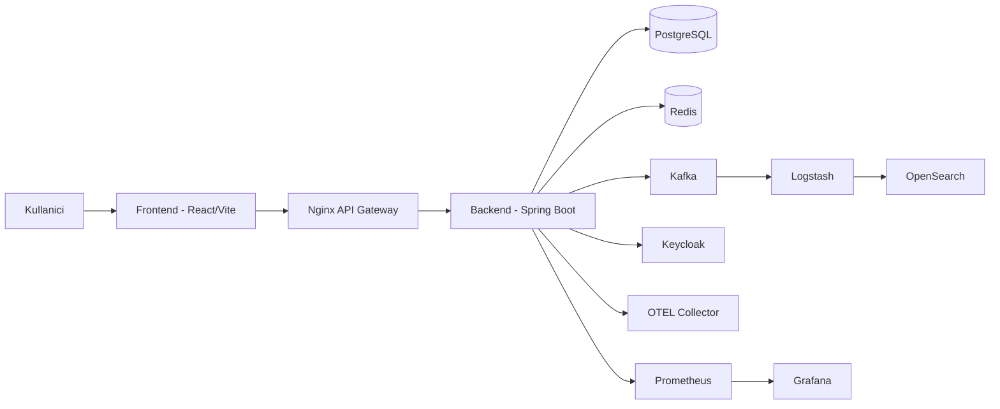

# Sistem Mimarisi

## 1. Amac ve Kapsam

Bu dokuman, MintStack Finance Portal sisteminin calisma topolojisini, servis sorumluluklarini ve temel veri akislarini teknik toplanti sunumunda kullanilacak seviyede ozetler.

## 2. Ust Seviye Mimari (C4-Container)

## 3. Servis Sorumluluklari

- Frontend: UI, state yonetimi, RTK Query ile API tuketimi, WebSocket dinleme.
- Nginx: Tek giris noktasi, API ve WebSocket reverse proxy.
- Backend: Is kurallari, portfoy islemleri, market veri toplama, scheduler, auth kontrol.
- PostgreSQL: Kalici is verisi (kullanici, portfoy, emir, fiyat gecmisi, haber).
- Redis: Sicak veri cache ve performans optimizasyonu.
- Kafka: Olay akisi ve log boru hatti.
- Logstash/OpenSearch: Log isleme, indeksleme, arama.
- Prometheus/Grafana: Metrik toplama, panel ve alarm.
- Keycloak: OAuth2/OIDC kimlik dogrulama ve rol bazli yetkilendirme.

## 4. Katmanli Backend Tasarimi

- `controller`: REST endpointleri
- `service`: Is kurallari ve orkestrasyon
- `repository`: Veri erisim katmani
- `entity`: JPA model nesneleri
- `scheduler`: Zamanlanmis veri toplama ve guncelleme
- `config`: Security, Kafka, Redis, WebSocket, OpenSearch ayarlari

## 5. Temel Veri Akislari

### 5.1 Piyasa Verisi

1. Scheduler, tercih edilen saglayicidan veriyi ceker.
2. Veri normalize edilir ve PostgreSQL'e yazilir.
3. Sicak okuma senaryolari Redis cache'e alinır.
4. Gerekli durumlarda WebSocket ile istemcilere anlik guncelleme aktarilir.

### 5.2 Portfoy Islem Akisi

1. Kullanici emir olusturur (`BUY/SELL`, `MARKET/LIMIT/STOP`).
2. Emir dogrulama ve nakit/pozisyon kontrolu yapilir.
3. Uygun kosulda emir gerceklesir, degilse bekleyen emre duser.
4. Portfoy ozeti, gerceklesen islemler ve PnL yeniden hesaplanir.

## 6. Performans ve Olceklenebilirlik Notlari

- API gecikmesini azaltmak icin Redis cache kullanilir.
- WebSocket ile polling ihtiyaci azaltilir.
- Kafka ile log/olay isleme asenkron hale getirilir.
- KRaft modunda Kafka ile Zookeeper bagimliligi kaldirilmistir.

## 7. Bilinen Teknik Riskler

- TypeScript strict modu henuz acik degil (`strict: false`).
- Bazi servisler (ozellikle portfoy/market data) hala buyuk ve bolunmeye aday.
- Tek backend uygulamasi (moduler monolith) ileride bounded context bazli ayrilabilir.

## 8. Toplanti Icin Kisa Mesaj

"Mimariyi tek giris noktali, guvenli, gozlemlenebilir ve moduler bir yapiya getirdik; veri akisinda cache + scheduler + websocket kombinasyonuyla hem guncellik hem performans hedefini tuttuk."
