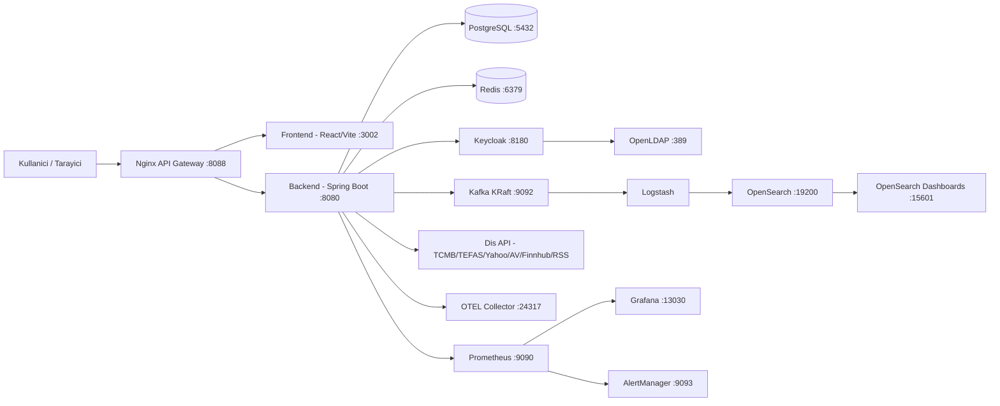
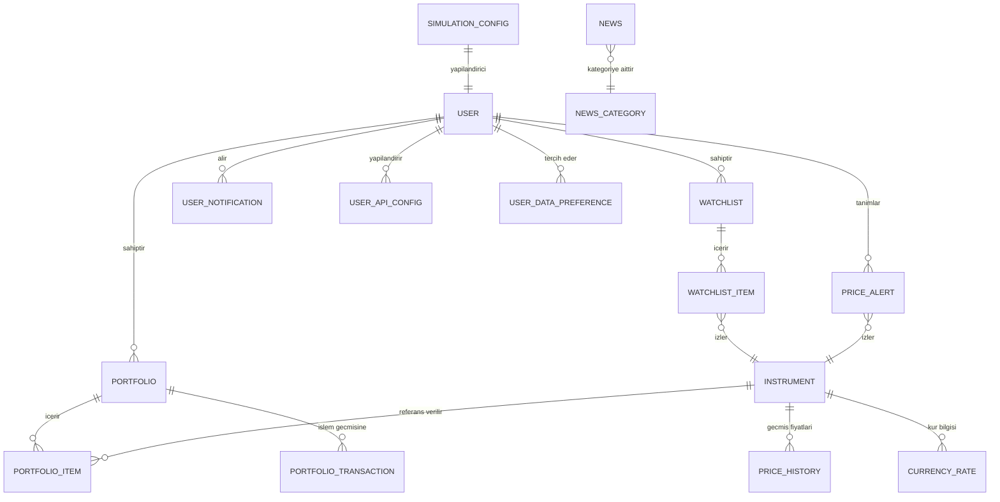
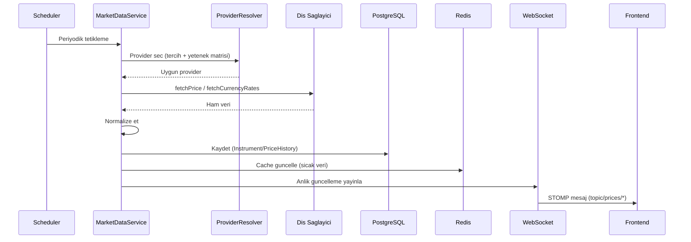
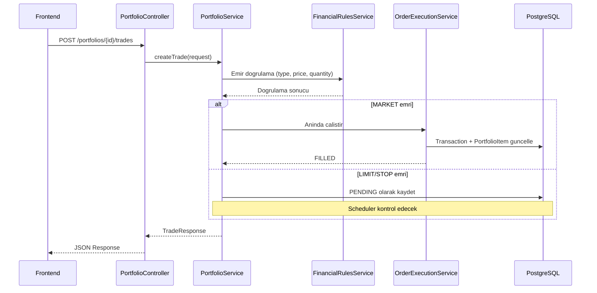
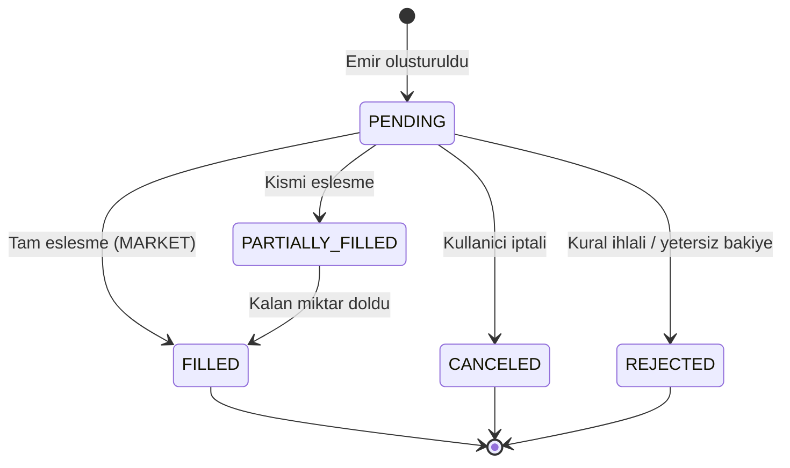
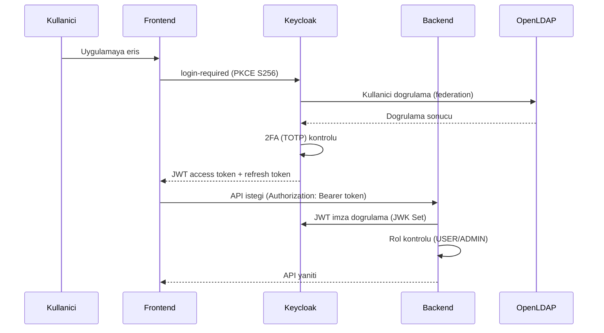

# Sistem Mimarisi

## 1. Amaç ve Kapsam

Bu doküman, MintStack Finance Portal sisteminin çalışma topolojisini, servis sorumluluklarını, katman mimarisini ve temel veri akışlarını detaylı olarak açıklar. Jüri toplantısında tasarım kararlarının gerekçelerini ve uygulamadaki karşılıklarını göstermek amacıyla hazırlanmıştır.

## 1.1 Teknoloji Sürüm Matrisi (Doğrulanmış)

Bu tablo doğrudan proje dosyalarından (`backend/pom.xml`, Maven dependency tree, `frontend/package.json` + lockfile, `docker-compose*.yml`) doğrulanmıştır.

| Katman | Teknoloji | Sürüm |
|---|---|---|
| Backend | Java | 21 |
| Backend | Spring Boot | 3.4.2 |
| Backend | Spring Security Config | 6.4.2 |
| Backend | Spring Data JPA | 3.4.2 |
| Backend | Spring WebSocket | 6.2.2 |
| Backend | Spring WebFlux | 6.2.2 |
| Backend | Spring Kafka | 3.3.2 |
| Backend | Flyway Core | 10.20.1 |
| Backend | Resilience4j | 2.2.0 |
| Backend | Bucket4j | 8.7.0 |
| Backend | Log4j2 JSON Layout | 2.24.3 |
| Backend | Quartz | 2.3.2 |
| Backend | OpenSearch Java Client | 2.11.0 |
| Frontend | React / React DOM | 18.3.1 |
| Frontend | TypeScript | 5.9.3 |
| Frontend | Vite | 5.4.21 |
| Frontend | Redux Toolkit | 2.11.2 |
| Frontend | React Router DOM | 6.30.3 |
| Frontend | Tailwind CSS | 3.4.19 |
| Frontend | Keycloak JS | 26.2.3 |
| Frontend | STOMP.js / SockJS | 7.2.1 / 1.6.1 |
| Frontend | i18next | 23.16.8 |
| Frontend | Recharts | 2.15.4 |
| Test | Vitest / Coverage V8 | 1.6.1 / 1.6.1 |
| Test | Playwright | 1.57.0 |
| Test | Testcontainers | 1.19.3 |
| Altyapı | PostgreSQL | 15-alpine |
| Altyapı | Redis | 7-alpine |
| Altyapı | Keycloak | 26.5.4 |
| Altyapı | OpenLDAP | 1.5.0 |
| Altyapı | Kafka (Confluent CP) | 7.5.0 |
| Altyapı | OpenSearch / Dashboards | 2.13.0 / 2.13.0 |
| Altyapı | Logstash | 8.9.0 |
| Altyapı | Prometheus | 2.48.0 |
| Altyapı | Grafana | 10.2.2 |
| Altyapı | AlertManager | 0.26.0 |
| Altyapı | OTEL Collector | 0.91.0 |

## 2. Üst Seviye Mimari (C4 Container View)

## 3. Servis Sorumlulukları

### 3.1 Uygulama Katmanı

| Servis | Sorumluluk |
|---|---|
| **Frontend (React 18.3.1 + Vite 5.4.21)** | Kullanıcı arayüzü, state yönetimi (Redux Toolkit), RTK Query ile API tüketimi, WebSocket (STOMP) ile gerçek zamanlı veri dinleme, Keycloak JS ile kimlik doğrulama, code splitting (lazy loading), dark/light tema, i18n (TR/EN). |
| **Backend (Spring Boot 3.4.2)** | İş kuralları, portföy işlemleri, piyasa verisi toplama ve normalize etme, emir yaşam döngüsü yönetimi, teknik analiz hesaplamaları (Monte Carlo, backtesting, RSI, MA), zamanlı görevler (scheduler), cache yönetimi, event yayınlama, dışa aktarım (Excel/PDF). |
| **Nginx (alpine image)** | Tek giriş noktası (API Gateway), `/api/v1` isteklerini backend'e, WebSocket trafiğini (`/ws`) backend'e, statik içerikleri frontend'e reverse proxy. |

### 3.2 Veri Katmanı

| Servis | Sorumluluk |
|---|---|
| **PostgreSQL 15** | Kalıcı iş verisi (3 veritabanı: `mintstack_finance`, `keycloak`, `mintstack`). Kullanıcı, portföy, enstrüman, işlem geçmişi, fiyat geçmişi, haber, alarm, bildirim verilerini saklar. 24 Flyway migrasyonu ile şema yönetimi. |
| **Redis 7-alpine** | Sıcak veri cache'i, piyasa verisi ara belleği, rate limiting sayaçları. Okuma performansını artırmak için yoğun sorgulanan verileri (döviz kurları, hisse fiyatları) Redis'te tutar. |
| **Kafka (KRaft, 7.5.0)** | Olay akışı (event streaming) ve log boru hattı. SASL/PLAIN doğrulama ile güvenli. Zookeeper bağımlılığı KRaft modu ile kaldırıldı. Uygulama logları ve market data event'leri Kafka üzerinden Logstash'e iletilir. |

### 3.3 Kimlik ve Güvenlik Katmanı

| Servis | Sorumluluk |
|---|---|
| **Keycloak 26** | OAuth2/OIDC kimlik sunucusu. Realm yönetimi (`mintstack-finance`), client tanımları (`finance-frontend`, `finance-backend`), rol bazlı yetkilendirme (USER, ADMIN), 2FA (TOTP), Remember Me, LDAP federation. |
| **OpenLDAP 1.5.0** | Kurumsal dizin hizmeti. Keycloak ile LDAP federation üzerinden kullanıcı senkronizasyonu. |

### 3.4 Gözlemlenebilirlik Katmanı

| Servis | Sorumluluk |
|---|---|
| **Prometheus 2.48.0** | Uygulama metrikleri toplama (Spring Actuator + Micrometer). CPU, memory, request latency, cache hit/miss, Kafka consumer lag vb. |
| **Grafana 10.2.2** | Metrik görselleştirme, dashboard'lar ve alarm tanımları. Otomatik provisioning ile hazır dashboard'lar yüklenir. |
| **AlertManager 0.26.0** | Prometheus sistem alarm kurallarına göre operasyonel bildirim gönderme (e-posta, webhook). Kullanıcı fiyat alarmlarından ayrıdır. |
| **OpenSearch 2.13.0** | Log indeksleme, tam metin arama, log analizi. Güvenlik eklentisi aktif. |
| **OpenSearch Dashboards 2.13.0** | Log arama ve görselleştirme arayüzü. |
| **Logstash 8.9.0** | Log işleme pipeline'ı: Kafka'dan log tüketir, parse eder, OpenSearch'e indeksler. |
| **OTEL Collector 0.91.0** | Distributed tracing toplama. Uygulama span'lerini toplar ve OpenSearch'e gönderir. |

## 4. Katmanlı Backend Tasarımı

### 4.1 Katman Yapısı

| Katman | Paket | Dosya Sayısı | Sorumluluk |
|---|---|---|---|
| **Controller** | `controller/` | 15 | REST endpoint tanımları, request validation, response mapping |
| **Service** | `service/` | 52+ | İş kuralları, orkestrasyon, cache yönetimi, dış servis çağrıları |
| **Repository** | `repository/` | 15 | JPA/Hibernate ile veritabanı erişimi, özel JPQL sorguları |
| **Entity** | `entity/` | 17 | JPA domain modelleri, `BaseEntity` ile audit (createdAt, updatedAt) |
| **DTO** | `dto/` | ~30 | İstek/yanıt veri transfer nesneleri, cache ve simülasyon DTO'ları |
| **Config** | `config/` | 17 | Security, Kafka, Redis, WebSocket, OpenSearch, CORS, Rate Limit, Email yapılandırmaları |
| **Scheduler** | `scheduler/` | 7 | Zamanlanmış veri toplama, fiyat güncelleme, veri temizliği |
| **Filter** | `filter/` | — | HTTP request/response filtreleri |
| **Mapper** | `mapper/` | — | MapStruct Entity↔DTO dönüşümleri |
| **Aspect** | `aspect/` | — | AOP cross-cutting concern'ler |

### 4.2 Servis Alt Paketleri

| Alt Paket | İçerik |
|---|---|
| `service/external/` | Dış API istemcileri (TcmbApiClient, TefasFundClient, YahooFinanceClient, AlphaVantageClient, FinnhubClient, RssNewsClient) |
| `service/portfolio/` | Portföy finansal kuralları ve emir çalıştırma motoru |
| `service/simulation/` | Piyasa simülasyon motoru (fiyat, haber senaryoları, market event) |
| `service/market/` | Enstrüman metrik servisi ve market veri bakımı |
| `service/search/` | OpenSearch entegrasyonu |
| `service/event/` | Kafka event publisher ve consumer |
| `service/strategy/` | Trading stratejileri (MovingAverageCrossover, RSI) |

## 4. Veri Modeli ve Entity'ler

### 4.1 ER Diyagramı (Mantıksal)

### 4.2 Entity Grupları

| Grup | Entity'ler | Sorumluluk |
|---|---|---|
| **Kimlik/Yetki** | User, UserApiConfig, UserDataPreference | Profil, API key'leri, veri tercihleri |
| **Portföy** | Portfolio, PortfolioItem, PortfolioTransaction | Sanal portföy, pozisyonlar, emir/işlem geçmişi |
| **Piyasa** | Instrument, PriceHistory, CurrencyRate | Enstrümanlar, geçmiş fiyatlar, döviz kurları |
| **İzleme** | Watchlist, WatchlistItem, PriceAlert, UserNotification | İzleme listeleri, fiyat alarmları, bildirimler |
| **İçerik** | News, NewsCategory | Haber aggregasyonu, kategoriler |

---

## 5. İletişim Protokolleri ve Veri Akışıları

### 5.1 Piyasa Verisi Toplama Akışı

### 5.2 Portföy Emir İşlem Akışı

### 5.3 Emir Yaşam Döngüsü

### 5.4 Kimlik Doğrulama Akışı

## 6. Docker Servis Topolojisi

Varsayılan dev ortamında toplam **15 konteyner** çalışır:

| Katman | Servisler | Toplam Kaynak (Limit) |
|---|---|---|
| **Veri** | PostgreSQL, Redis, Keycloak, OpenLDAP | ~2.5 GB RAM |
| **Gözlemlenebilirlik** | Kafka, OpenSearch, OpenSearch Dashboards, Logstash, OTEL, Prometheus, Grafana, AlertManager | ~4 GB RAM |
| **Uygulama** | Backend, Frontend, Nginx | ~1.5 GB RAM |

Tüm servisler `mintstack-network` bridge ağında çalışır. Dış erişime yalnızca Nginx (8088), Frontend (3002) ve Keycloak (8180) portları açılır; diğer servisler `127.0.0.1` binding ile dış erişime kapalıdır.

## 7. Performans ve Ölçeklenebilirlik

- **Redis Cache:** API gecikme süresini azaltmak için döviz kurları, hisse fiyatları cache'te tutulur.
- **WebSocket:** Polling ihtiyacını ortadan kaldırır; frontend'e anlık fiyat güncellemesi (STOMP).
- **Asenkron:** Kafka ile log/olay işleme asenkron hale getirilir.
- **Rate Limiting:** Bucket4j ile API kötüye kullanımı engellenir.
- **Circuit Breaker:** Resilience4j ile dış API çağrılarında hata toleransı.
- **Code Splitting:** React lazy loading ile ilk sayfa yükleme süresi optimize edilir.
- **KRaft Modu:** Kafka'da Zookeeper bağımlılığı kaldırılmış, operasyonel karmaşıklık azaltılmıştır.

## 8. Bilinen Teknik Riskler ve İyileştirme Alanları

| Risk / İyileştirme | Durum | Öneri |
|---|---|---|
| TypeScript strict modu kapalı (`strict: false`) | ⚠️ Aktif risk | Aşamalı olarak strict moda geçiş |
| Bazı servisler büyük (PortfolioService, MarketDataService) | ⚠️ İyileştirme alanı | Daha fazla domain service'e bölünmeli |
| Tek backend uygulaması (modüler monolith) | ℹ️ Bilinçli karar | Ölçek ihtiyacında bounded context bazlı ayrıştırma |
| Simülasyon ve gerçek veri ayrımı | ✅ Çözüldü | V11 + V18 migrasyonları ile `isSimulated` flag |
