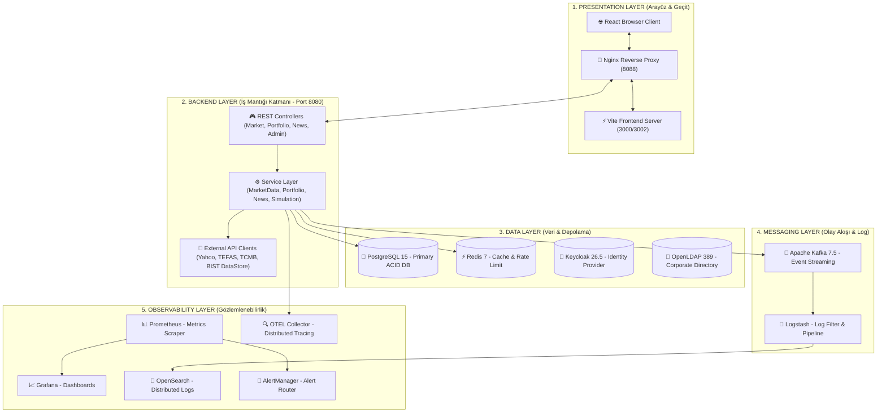
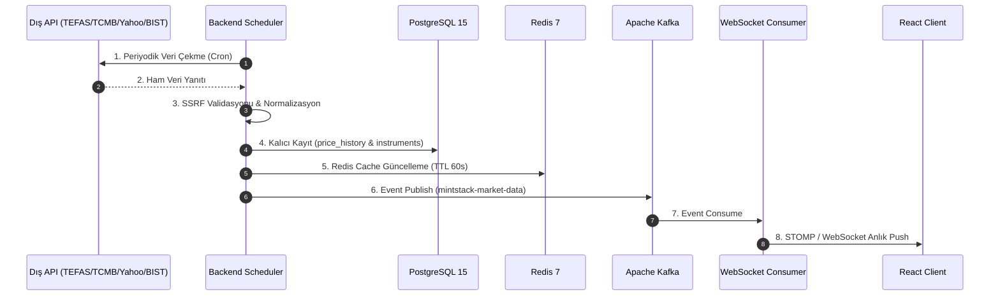
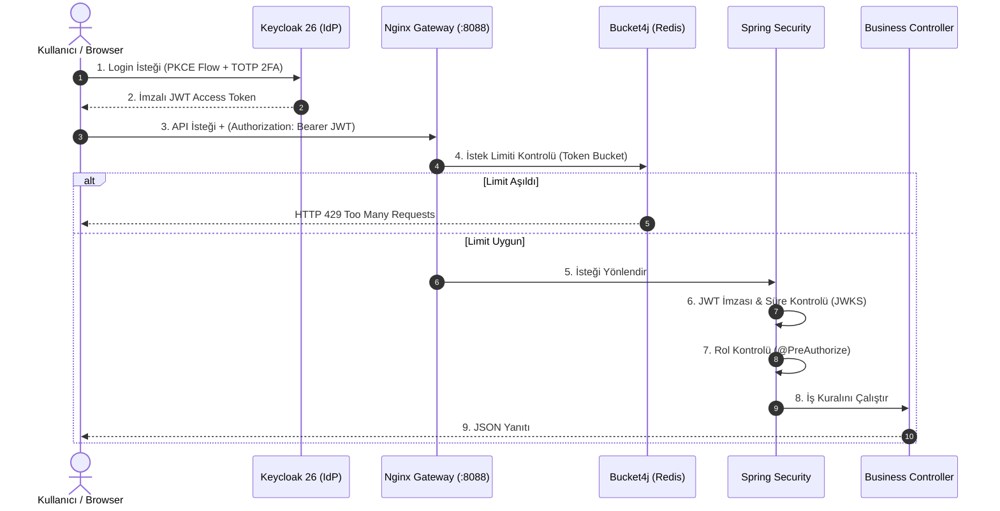
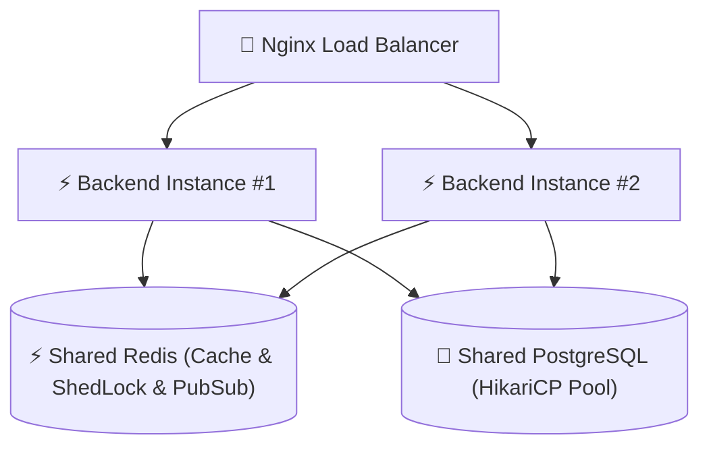

# 🏛️ MintStack Finance Portal: Derinlemesine Sistem Mimarisi, Docker ve Mülakat Rehberi

> **Doküman Amacı:** Bu doküman, MintStack Finance Portal projesinin mimari bileşenlerini, 14 Docker servisini, veri ve güvenlik akışlarını, ölçeklendirme stratejilerini ve teknik mülakat/jüri sunumunda karşılaşılabilecek tüm soru-cevapları tek bir çatı altında toplamak amacıyla hazırlanmıştır.

---

## 📐 PART 1: 3-Katmanlı Mimari ve 14 Servisin Derinlemesine Analizi

---

### 📦 14 Servisin Detaylı Teknik Kırılımı

| # | Servis Adı | Teknoloji & Port | Ne İşe Yarar? (Çalışma Mantığı) | Neden Seçildi & Avantajı |
|---|:--- |:--- |:--- |:--- |
| 1 | **`nginx`** | Nginx (`8088`) | **API Gateway & Reverse Proxy:** Dış dünyadan gelen tüm istekleri tek porttan karşılar. SSL/TLS sonlandırması, statik dosya sunumu ve yönlendirme yapar. | Backend servislerini gizleyerek güvenlik sağlar. Tek giriş kapısı üzerinden CORS ve yönlendirme karmaşıklığını çözer. |
| 2 | **`frontend`** | React 18 / Vite (`3000/3002`) | **Kullanıcı Arayüzü (SPA):** Canlı borsa takibi, portföy yönetimi, teknik analiz grafiklerini sunan reaktif web arayüzüdür. | Vite ile 10x daha hızlı derleme (HMR) sunar. RTK Query ile API isteklerini önbellekler. |
| 3 | **`backend`** | Java 21 / Spring Boot 3.4.2 (`8080`) | **Çekirdek İş Motoru:** Finansal hesaplamalar (PnL, FIFO), teknik analiz göstergeleri (RSI, MACD), dış API entegrasyonu ve iş kurallarını yönetir. | Java 21 **Virtual Threads** desteği ile yüksek eşzamanlı istek işleme kapasitesi sunar. |
| 4 | **`postgres`** | PostgreSQL 15 (`5432`) | **İlişkisel Ana Veritabanı:** Kullanıcı, portföy, işlem geçmişi ve enstrüman verilerini saklar. **Flyway** (V1-V31) ile şema değişikliklerini sürümler. | Finansal verilerde **ACID** garantisi zorunludur. Veri kaybını ve tutarsızlığı önler. |
| 5 | **`redis`** | Redis 7 (`6379`) | **Cache & Rate Limit Store:** Canlı fiyatları bellekte saklar. **Bucket4j** ile rate limiting tutar. **ShedLock** ile çoklu backend kilitlerini yönetir. | RAM üzerinde nano-saniye seviyesinde okuma yapar. DB üzerindeki yükü %90 azaltır. |
| 6 | **`keycloak`** | Keycloak 26.5.4 (`8180`) | **Merkezi Kimlik Yönetimi (IdP):** OAuth2/OIDC standartlarında **JWT** üretir, RBAC rollerini yönetir ve **TOTP (2FA)** doğrulamasını sağlar. | Kimlik doğrulama karmaşıklığını uzmana devrederek güvenliği üst düzeye çıkarır. |
| 7 | **`openldap`** | OpenLDAP (`389`) | **Şirket Dizini Entegrasyonu:** Kurumsal kullanıcıların var olan Active Directory / LDAP hesapları ile giriş yapabilmesini sağlar. | Kurumsal SSO (Single Sign-On) gereksinimlerini karşılar. |
| 8 | **`kafka`** | Apache Kafka 7.5 (`29092`) | **Event Streaming Bus:** Piyasa verisi değişiklikleri, alarmlar ve logları asenkron olarak servisler arası taşır (KRaft mode). | Olay güdümlü mimari ile yüksek veri trafiğinde backend thread'lerini bloklamaz. |
| 9 | **`logstash`** | Logstash 8.x | **Log Pipeline:** Kafka `mintstack-logs` konusundan ham JSON logları okur, filtreler ve OpenSearch'e indeksler. | Log biçimlendirme ve ayrıştırma iş yükünü veritabanından alır. |
| 10 | **`opensearch`** | OpenSearch 2.13 (`9200/9600`) | **Dağıtık Log & Arama Motoru:** Uygulama loglarını tam metin (full-text) aranabilir şekilde saklar ve indeksler. | Milyonlarca log satırı içinde milisaniyeler seviyesinde arama ve hata analizi imkanı verir. |
| 11 | **`prometheus`** | Prometheus (`9090`) | **Metrik Toplayıcı:** Backend `/actuator/prometheus` endpoint'inden JVM bellek, HTTP latency ve DB havuz metriklerini toplar. | Zaman serisi veritabanı (TSDB) ile anlık sistem sağlığı izlemesi sağlar. |
| 12 | **`grafana`** | Grafana (`13030`) | **Görsel İzleme Panoları:** Prometheus metriklerini görsel grafiklere dönüştürür (JVM, Cache Hit/Miss, Latency). | Sistem sağlığını tek bakışta izlemeyi ve darboğazları tespit etmeyi sağlar. |
| 13 | **`alertmanager`**| AlertManager (`9093`) | **Alarm Yönlendirici:** Prometheus kurallarındaki kritik eşik aşımlarında (Örn: HTTP 5xx > %5) mail/webhook uyarısı atar. | Erken uyarı mekanizması ile sistem kesintilerine anında müdahale imkanı verir. |
| 14 | **`otel-collector`**| OpenTelemetry | **Dağıtık İzleme (Tracing):** İsteklerin Nginx -> Backend -> DB -> Kafka adımlarında izlediği yolu `trace_id` ile kaydeder. | Mikroservis/Modüler yapılarda uçtan uca performans darboğazı analizine imkan tanır. |

---

## 🔄 PART 2: Kritik İşlem Akışları (Data & Security Flows)

### 1️⃣ Piyasa Verisi Toplama ve Anlık Yayın Akışı (Market Data Flow)

---

### 2️⃣ Güvenli Kimlik Doğrulama & İstek Akışı (Authentication & Security Flow)

---

### 3️⃣ Simülasyon Modu Akışı (Simulation Mode Flow)

- **Amac:** Dış API kotalarını harcamadan veya kapalı piyasa saatlerinde gerçekçi test yapabilmektir.
- **Algoritma:** `SimulationDataService`, **Geometric Brownian Motion (Random Walk)** algoritması ile hisse, döviz ve endeksler için gerçekçi fiyat adımları üretir.
- **Etiketleme Kuralı:** Üretilen tüm simülasyon verilerinin üzerine `isSimulated: true` veya `is_simulated = true` bayrağı işlenir. Kullanıcı arayüzünde bu veriler **"Simülasyon Verisi"** rozetiyle açıkça gösterilir.

---

## 🔐 PART 3: 8-Katmanlı Güvenlik Mimarisi (Security Layers)

1. **Ağ İzolasyonu (Network Isolation):** Veritabanları ve mesajlaşma servisleri (PostgreSQL, Redis, OpenSearch, Kafka) Docker dahili ağında (`mintstack-network`) tutulur. Dış dünyaya sadece Nginx (`8088`) kapısı açılır.
2. **SSL/TLS Şifreleme:** Canlı ortamda tüm iletişim HTTPS ve WSS (Secure WebSocket) protokolleriyle şifrelenir.
3. **WAF & Gateway Koruması:** Nginx seviyesinde kötü niyetli taramalar ve aşırı yük atakları engellenir.
4. **OAuth2 / OIDC (Keycloak):** Kullanıcı parolaları backend veritabanına uğramaz. Keycloak katmanında PBKDF2/bcrypt ile saklanır.
5. **RBAC (Role-Based Access Control):** `ROLE_USER` ve `ROLE_ADMIN` yetkileri Spring Security tarafında `@PreAuthorize("hasRole('ADMIN')")` ile metod seviyesinde korunur.
6. **Dağıtık Rate Limiting (Bucket4j + Redis):** IP ve Kullanıcı bazlı istek limitleri ile DDoS ve kaba kuvvet saldırıları önlenir (Anonim: 100 req/min, Auth: 1000 req/min).
7. **Girdi Validasyonu & XSS Temizliği:** Tüm DTO seviyesindeki girdiler `@Valid`, `@NotNull`, `@Pattern` ile denetlenir.
8. **SSRF Koruması (Server-Side Request Forgery):** Kullanıcıdan alınan URL/RSS kaynaklarında iç ağ IP bloklarına (`127.0.0.1`, `10.0.0.0/8`, `192.168.0.0/16`) istek atılması engellenir.

---

## 📊 PART 4: Yatay Ölçeklendirme & Kesintisiz Çalışma (Scaling Strategy)

- **Çoklu Instance Çalıştırma:** Nginx arkasında birden fazla Spring Boot Backend aynı anda replika olarak çalışabilir.
- **ShedLock ile Mükerrer Job Önleme:** Birden fazla backend ayağa kalktığında `MarketDataScheduler`'ın aynı anda 2 kere dış API'ye istek atmasını engellemek için **ShedLock (Redis)** kullanılır. İlk kilit alan servis scheduler'ı çalıştırır, diğeri pasif bekler.
- **Redis Pub/Sub ile WebSocket Senkronizasyonu:** İstemci hangi backend instance'ına bağlı olursa olsun, Redis Pub/Sub sayesinde canlı fiyat tüm kullanıcılara eşzamanlı dağıtılır.

---

## 🎯 PART 5: Mülakat & Jüri Sunumu İçin 15 Kritik Q&A (Soru - Cevap)

### ❓ S1: Mimariniz mikroservis mi yoksa monolith mi? Neden bu kararı aldınız?
**💬 Cevap:**  
> *"Sistemimiz **Modüler Monolith (Modüler Monolit)** mimarisindedir. Portföy, Piyasa, Analiz, Haberler ve Simülasyon gibi alanlar backend içinde katı paket izolasyonu ve interface'ler ile modüler olarak tasarlanmıştır. Mikroservislerin getirdiği ağ gecikmesi, dağıtık transactional yönetim zorluğu (Saga/2PC) ve aşırı operasyonel karmaşıklıktan kaçınarak tek bir Spring Boot 3.4.2 çatısı altında yüksek performans elde ettik. Gelecekte ihtiyaç duyulursa modüller kolayca bağımsız mikroservislere dönüştürülebilecek gevşek bağlılıktadır (loosely coupled)."*

---

### ❓ S2: Java 21 kullanmanın projeye kazandırdığı en büyük teknik avantaj nedir?
**💬 Cevap:**  
> *"En büyük kazancımız **Virtual Threads (Sanal İplikler - Project Loom)** kullanımıdır. Geleneksel OS thread'leri bellek açısından maliyetli (1MB/thread) ve sınırlıyken, Virtual Threads sayesinde yüz binlerce eşzamanlı HTTP ve WebSocket isteğini minimal RAM tüketimiyle işleyebiliyoruz. Ayrıca **Pattern Matching**, **Records** (DTO'larda boilerplate kod temizliği) ve **Sealed Classes** ile domain modelimizi çok daha güvenli hale getirdik."*

---

### ❓ S3: Güvenlik ve Kimlik Yönetimini nasıl kurguladınız? 2FA akışı nasıl çalışıyor?
**💬 Cevap:**  
> *"Kimlik yönetimini kurumsal **Keycloak 26.5.4** IdP sunucusuna devrettik (Stateless JWT tabanlı). İstemci login olduğunda OIDC standartlarında JWT alır. Backend tarafında Spring Security `OAuth2 Resource Server` olarak bu JWT'nin RS256 imzasını Keycloak JWKS endpoint'i üzerinden doğrular.*  
> *Kritik portföy ve admin işlemleri için Keycloak üzerinde **TOTP (Google Authenticator / Authy)** tabanlı 2FA politikasını zorunlu kıldık. Rol bazlı erişim denetimi (RBAC) ise `@PreAuthorize("hasRole('ADMIN')")` gibi anotasyonlarla metod seviyesinde uygulanmaktadır."*

---

### ❓ S4: Veritabanı şema değişikliklerini nasıl yönetiyorsunuz?
**💬 Cevap:**  
> *"Veritabanı şema değişiklikleri için **Flyway** kullanıyoruz. Projemizde V1'den V31'e kadar sıralı SQL migrasyon dosyaları bulunur. Uygulama kalkarken Flyway otomatik devreye girerek eksik migrasyonları çalıştırır. CI/CD hattımızda önce boş bir PostgreSQL üzerinde `flyway:migrate` sonra `flyway:validate` adımı çalışarak şema tutarlılığını garanti eder."*

---

### ❓ S5: Rate Limiting (İstek Sınırlama) mekanizmanız nasıl çalışıyor?
**💬 Cevap:**  
> *"Dağıtık mimariye uygun **Bucket4j** kütüphanesini **Redis** arkalığı ile kullandık. `Token Bucket` algoritması esastır. İstek yapan kullanıcının IP'si veya JWT kullanıcı ID'si üzerinden Redis üzerinde bir 'Kova' açılır. Kullanıcı tipine göre limitler belirlenmiştir (Örn: Anonim 100/dk, Kullanıcı 1000/dk). Her istek 1 token tüketir; kova boşaldığında sistem `HTTP 429 Too Many Requests` uyarısı döner ve `X-RateLimit-Reset` başlığı ile ne zaman tekrar istek atabileceğini bildirir."*

---

### ❓ S6: Piyasa verilerinde veri yarışmalarını (Race Condition) ve veri tutarsızlığını nasıl önlüyorsunuz?
**💬 Cevap:**  
> *"Emir motorunda ve bakiye güncellemelerinde **Pessimistic Locking** (`SELECT ... FOR UPDATE`) ve transactional boundary kullandık. İki farklı istek aynı anda aynı kullanıcının nakit bakiyesinden harcama yapmaya çalıştığında veritabanı kilit mekanizması sıralı işleme zorlar. Piyasa fiyat güncellemelerinde ise Redis önbelleği ve Kafka `idempotent consumer` mantığı ile mükerrer veri yazımları engellenir."*

---

### ❓ S7: Log mimarinizi anlatır mısınız? Loglar ana sistemi yavaşlatmıyor mu?
**💬 Cevap:**  
> *"Log mimarimiz **Log4j2 -> Apache Kafka -> Logstash -> OpenSearch** hattından oluşur. Uygulama logları Log4j2'nin `AsyncAppender` özelliği ile JSON formatına dönüştürülüp arka planda Kafka 'mintstack-logs' konusuna basılır. Ana uygulama akışı log yazmak için hiç beklemez (non-blocking). Logstash bu logları Kafka'dan çekip OpenSearch'e indeksler. Böylece merkezi arama ve izlenebilirlik elde ederiz."*

---

### ❓ S8: OpenTelemetry (OTEL) ve Tracing sisteminiz nasıl çalışıyor?
**💬 Cevap:**  
> *"İstek sisteme girdiği an Nginx veya Spring Boot Filter tarafından benzersiz bir `trace_id` üretilir. Bu `trace_id` hem Log4j2 MDC (Mapped Diagnostic Context) ortamına eklenir hem de OpenTelemetry Collector'a OTLP protokolü ile aktarılır. Grafana veya OpenSearch üzerinde arama yaptığımızda, tek bir `trace_id` ile kullanıcının isteğinin hangi mikrosaniyede veritabanına ulaştığını, hangi Kafka mesajını tetiklediğini uçtan uca görebiliriz."*

---

### ❓ S9: Dış API (TCMB, TEFAS, Yahoo Finance) kesildiğinde sistem nasıl davranıyor? (Resilience/Graceful Degradation)
**💬 Cevap:**  
> *"Sistemde yedekli sağlayıcı zinciri (Provider Chain) mevcuttur. Örneğin Hisse verisinde birincil API hata verirse ikincil sağlayıcıya düşer. Tüm dış API'ler kesilirse veya pasif edilirse:  
> 1. Eğer **Simülasyon Modu** açıksa simülasyon motoru devreye girer.  
> 2. Simülasyon kapalıysa sistem **Katı API Koruması** devreye sokarak uydurma/bayat fiyat göstermez; arayüzde 'API Kapalı' rozeti verir ve backfill butonlarını kilitler."*

---

### ❓ S10: Portföy Emir Motorunuz (Order Engine) nasıl çalışıyor?
**💬 Cevap:**  
> *"Emir motorumuz **FIFO (First In, First Out)** lot tüketim mantığıyla çalışır. Kullanıcı alış emri verdiğinde nakit kontrolü yapılır. Satış emri verildiğinde en eski alınan lotlar öncelikli harcanarak **Gerçekleşen Kâr/Zarar (Realized PnL)** hesaplanır. Anlık tutulan pozisyonlar ise canlı piyasa fiyatı ile karşılaştırarak **Gerçekleşmeyen Kâr/Zarar (Unrealized PnL)** olarak portföy özetinde güncellenir."*

---

### ❓ S11: Sanal Portföy verileri veya tüm kullanıcı verileri nasıl sıfırlanıyor?
**💬 Cevap:**  
> *"Kullanıcı ayarlarındaki 'Tüm Verileri Sıfırla' eylemi `/api/v1/settings/reset-user-data` endpoint'ini tetikler. Servis katmanında `@Transactional` katı isolation seviyesinde kullanıcının tüm portföyleri, pozisyonları, emir geçmişi, izleme listeleri ve fiyat alarmları **Atomik Cascade Delete** ile veritabanından tamamen temizlenir."*

---

### ❓ S12: Frontend performansını artırmak ve gereksiz render'ları önlemek için ne yaptınız?
**💬 Cevap:**  
> *"Frontend tarafında **RTK Query (Redux Toolkit Query)** kullanarak otomatik veri önbellekleme, deduplication ve tag-based cache invalidation sağladık. Ağır grafik bileşenlerinde `useMemo` ve `useCallback` hook'ları ile gereksiz re-render'ların önüne geçtik. Canlı WebSocket veri akışında ise gelen her tikte tüm sayfayı yenilemek yerine yalnızca ilgili hisse hücresini güncelleyen lokal state yapıları kurduk."*

---

### ❓ S13: TEFAS ve BIST DataStore entegrasyonunda neden resmi paketler yerine kendi native istemcinizi yazdınız?
**💬 Cevap:**  
> *"NPM veya Go tabanlı üçüncü parti kütüphaneler ek çalışma zamanı (runtime) bağımlılığı, lisans riski (GPL uyumu) ve güvenlik açığı riski getirecekti. Projemiz Spring Boot (Java) olduğu için **`TefasFundClient`** ve **`BistDataStoreClient`** bileşenlerini native Java HTTP client ile kendimiz yazdık. BIST günlük ZIP/CSV bültenlerini ve TEFAS servislerini doğrudan parse ederek sıfır ek bağımlılıkla yüksek performans sağladık."*

---

### ❓ S14: CI/CD boru hattınızda kalite ve güvenlik kapıları (Quality Gates) nelerdir?
**💬 Cevap:**  
> *"GitHub Actions üzerinde her commit için:  
> 1. **Backend:** JUnit 5 ile birim testler koşulur, **JaCoCo** ile satır (%50) ve branch (%35) kapsama eşiği denetlenir.  
> 2. **Frontend:** ESLint (0 hata/0 uyarı eşiği) ve TypeScript tip kontrolü (`tsc --noEmit`) yapılır.  
> 3. **Güvenlik:** Gitleaks ile kod içinde unutulmuş secret/şifre taraması yapılır.  
> 4. **DB Validation:** Geçici PostgreSQL üzerinde Flyway migrasyonlarının sorunsuz çalıştığı doğrulanır."*

---

### ❓ S15: Projeyi tek cümleyle jüriye nasıl özetlersiniz?
**💬 Cevap:**  
> *"MintStack Finance Portal; Java 21 ve Spring Boot 3.4.2 altyapısında çalışan, Keycloak ile 2FA güvenliği sağlanmış, Redis ve Kafka ile ölçeklendirilen, Prometheus/OpenTelemetry ile %100 gözlemlenebilir, BIST, TEFAS ve VİOP verilerini gerçek zamanlı işleyen kurumsal bir finans ve portföy yönetim platformudur."*
