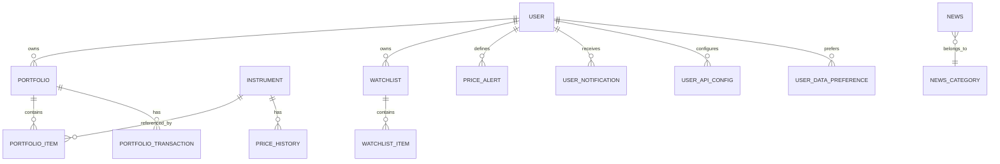
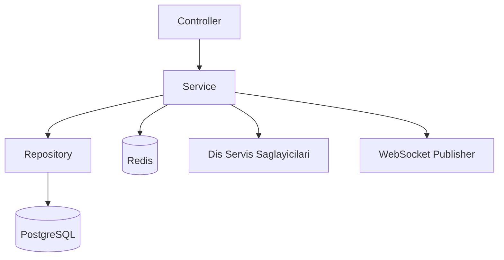
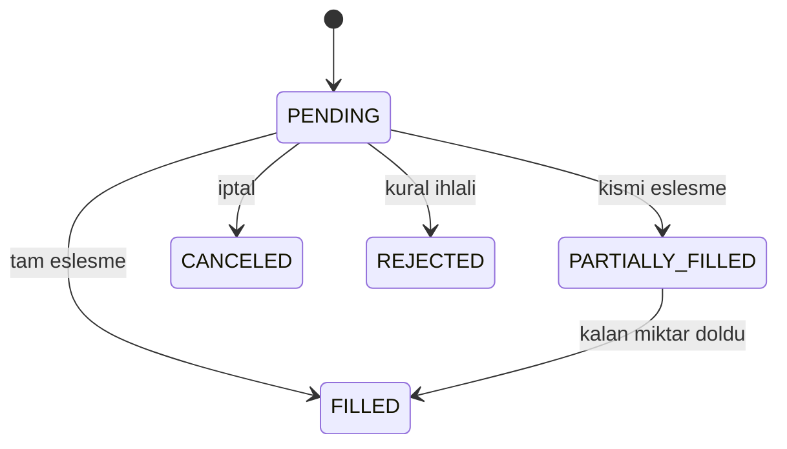
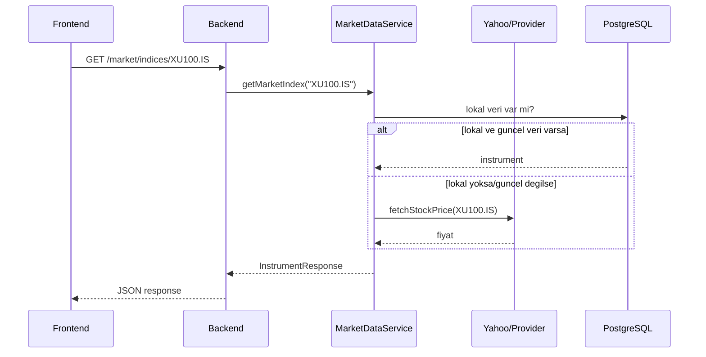

# Tasarim Mimarisi ve Modelleme

## 1. Domain Model Ozeti

Sistemin cekirdek domaini 5 ana grupta toplanir:

- Kimlik ve Yetki: User, Role, ApiConfig
- Portfoy: Portfolio, PortfolioItem, PortfolioTransaction
- Piyasa: Instrument, PriceHistory, CurrencyRate
- Izleme: Watchlist, PriceAlert, UserNotification
- Icerik: News, NewsCategory

## 2. ER Model (Mantiksal)

## 3. Uygulama Modeli (Katmanlar)

## 4. Kritik Is Akisi Modeli

### 4.1 Portfoy Emir Yasam Dongusu

### 4.2 BIST100 Veri Akisi

## 5. Veri Dogrulama Kurallari

- Emir olusturmada `instrumentId` veya `instrumentSymbol` zorunlu.
- `LIMIT` emirde `limitPrice`, `STOP` emirde `stopPrice` zorunlu.
- Nakit hareketinde `DEPOSIT/WITHDRAW` disi aksiyon kabul edilmez.
- Veri kaynagi seciminde provider yetenek matrisi kontrol edilir.

## 6. Tasarim Kalitesi ve Iyilestirme Alanlari

- Portfoy alani daha fazla domain service'e bolunebilir.
- Market data provider dispatch katmani ayriklastirilabilir.
- TypeScript strict + daha guclu tip kontratlari ile frontend kalitesi artirilabilir.

## 7. Toplanti Sunumu Icin Vurgu

- Modelin merkezinde "Portfoy + Enstruman + Islem" uclusu var.
- Cekirdek akislarda synchronous API + asynchronous update kombinasyonu kullaniliyor.
- Domain kurallari service katmaninda toplandigi icin testlenebilirlik ve degisiklik yonetimi kolay.
