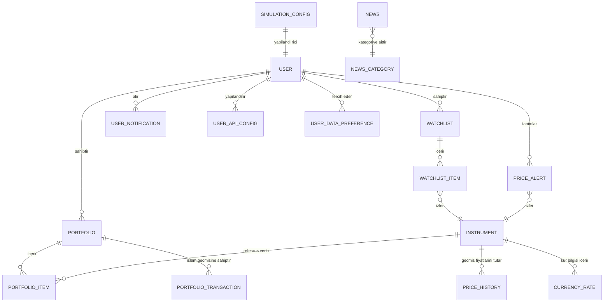
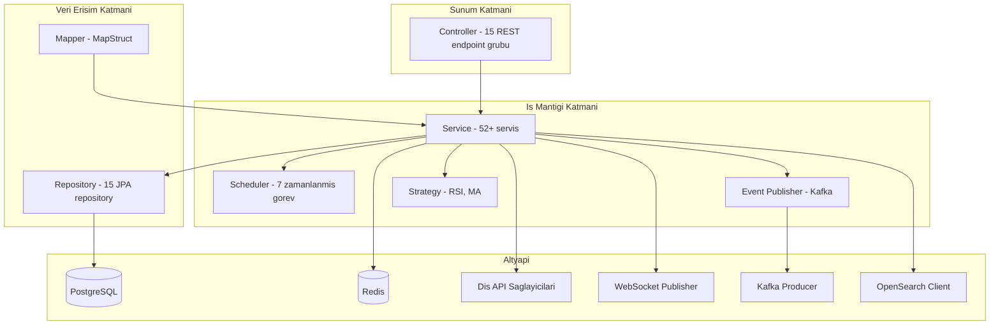
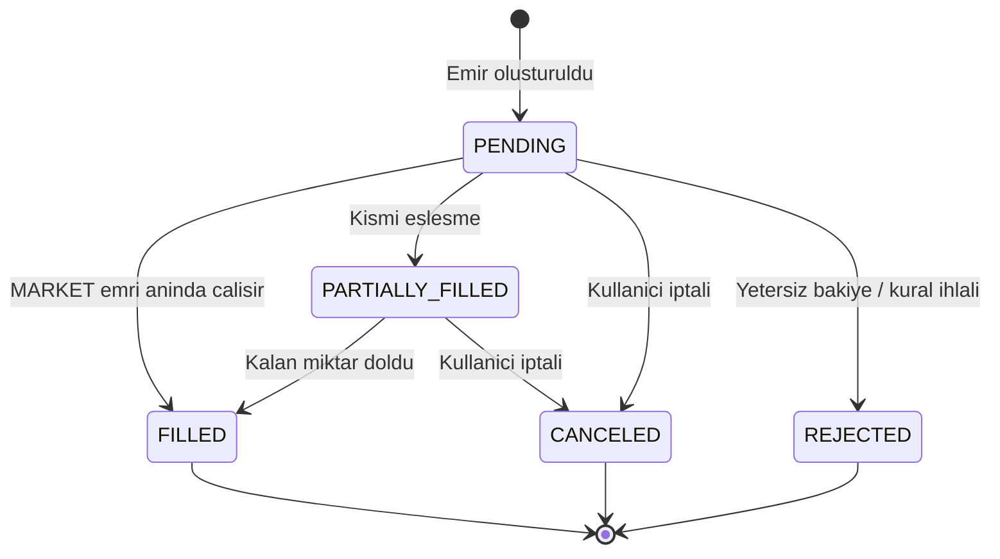
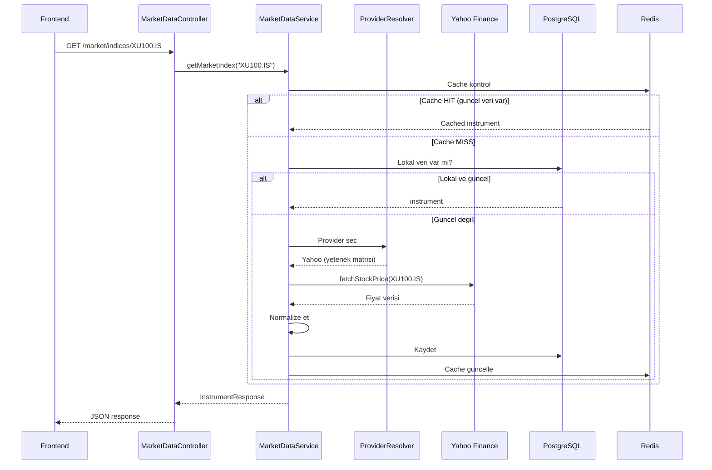
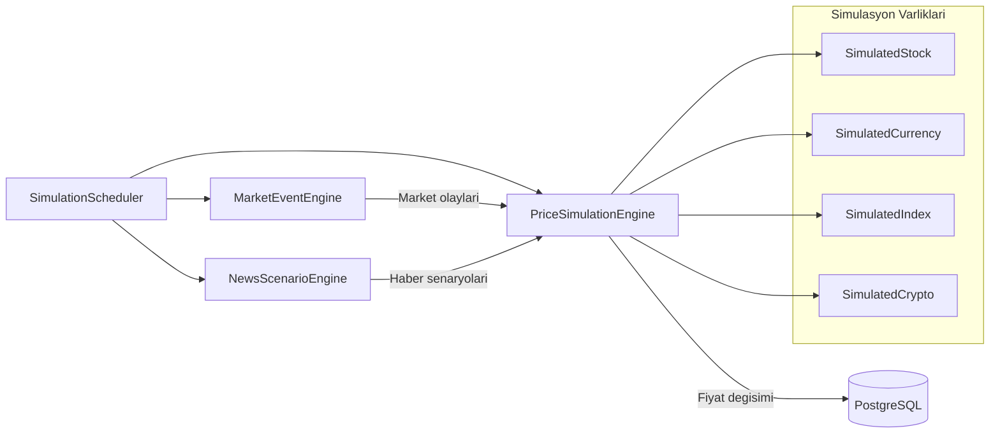
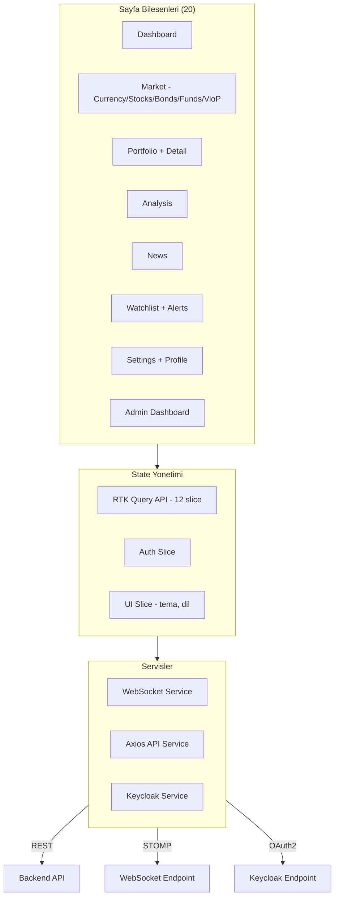

# Tasarım Mimarisi ve Modelleme

## 1. Domain Model Özeti

Sistemin çekirdek domaini **5 ana aggregate** grubunda toplanır. Her grup, kendi iç tutarlılığını koruyarak bağımsız yönetilebilir birimler oluşturur.

### 1.1 Domain Grupları

| Grup | Entity'ler | Sorumluluk |
|---|---|---|
| **Kimlik ve Yetki** | User, UserApiConfig, UserDataPreference | Kullanıcı profili, API key yönetimi, veri kaynağı tercihleri |
| **Portföy** | Portfolio, PortfolioItem, PortfolioTransaction | Sanal portföy, pozisyon takibi, emir/işlem geçmişi |
| **Piyasa** | Instrument, PriceHistory, CurrencyRate | Enstrüman tanımları, fiyat geçmişi, döviz kurları |
| **İzleme** | Watchlist, WatchlistItem, PriceAlert, UserNotification | İzleme listeleri, fiyat alarmları, bildirimler |
| **İçerik** | News, NewsCategory | Haber aggregasyonu, kategori yönetimi |

### 1.2 Entity Sayısal Profili

- **Toplam Entity:** 17 (+ BaseEntity abstract sınıf)
- **Toplam Repository:** 15
- **Flyway Migrasyonu:** V1-V18 (18 migrasyon dosyası)
- **Audit Trail:** Tüm entity'ler `BaseEntity` üzerinden `createdAt` ve `updatedAt` alanlarını devralır

## 2. ER Model (Mantıksal)

### 2.1 Temel Entity Alanları

#### User
- `id`, `keycloakId`, `username`, `email`, `firstName`, `lastName`
- `preferredLanguage`, `timezone`, `notificationPreferences`

#### Portfolio
- `id`, `name`, `description`, `userId`, `initialCash`, `currentCash`
- `totalValue`, `realizedPnl`, `unrealizedPnl`

#### Instrument
- `id`, `symbol`, `name`, `type` (STOCK, CURRENCY, BOND, FUND, INDEX, CRYPTO, VIOP)
- `lastPrice`, `changePercent`, `volume`, `isSimulated`
- `provider` (TCMB, YAHOO, ALPHA_VANTAGE, FINNHUB, SIMULATION)

#### PortfolioTransaction
- `id`, `portfolioId`, `instrumentId`, `transactionType` (BUY, SELL, DEPOSIT, WITHDRAW)
- `orderType` (MARKET, LIMIT, STOP), `orderStatus` (PENDING, FILLED, PARTIALLY_FILLED, CANCELED, REJECTED)
- `quantity`, `price`, `limitPrice`, `stopPrice`, `commission`

## 3. Uygulama Modeli (Katmanlar)

## 4. Kritik İş Akışı Modelleri

### 4.1 Portföy Emir Yaşam Döngüsü

**İş Kuralları:**
- `MARKET` emri: Anında mevcut fiyattan çalıştırılır
- `LIMIT` emri: Fiyat belirtilen seviyeye ulaştığında çalışır (`limitPrice` zorunlu)
- `STOP` emri: Fiyat stop seviyesine ulaştığında tetiklenir (`stopPrice` zorunlu)
- Nakit kontrolü: Alım emirlerinde yeterli `currentCash` doğrulanır
- Pozisyon kontrolü: Satış emirlerinde yeterli `quantity` doğrulanır
- Komisyon: İşlem tutarı üzerinden hesaplanır ve nakit bakiyesinden düşülür

### 4.2 Piyasa Verisi Toplama Akışı (BIST100 Örneği)

### 4.3 Veri Kaynağı Çözümleme Matrisi

| Veri Tipi | TCMB | Yahoo Finance | Alpha Vantage | Finnhub | Simülasyon |
|---|---|---|---|---|---|
| Döviz Kurları | ✅ Birincil | ✅ Yedek | ✅ Yedek | — | ✅ |
| BIST Hisse | — | ✅ Birincil | ✅ Yedek | — | ✅ |
| Global Hisse | — | ✅ Birincil | ✅ Yedek | ✅ | — |
| Kripto | — | ✅ | — | ✅ | ✅ |
| Tahvil/Bono | — | ✅ | — | — | ✅ |
| Fon | — | ✅ | — | — | ✅ |
| VİOP | — | — | — | — | ✅ |

### 4.4 Simülasyon Motoru Akışı

## 5. Frontend Bileşen Mimarisi

## 6. Veritabanı Migrasyon Geçmişi

| Migrasyon | Açıklama |
|---|---|
| V1 | İlk şema (User, Instrument, PriceHistory, CurrencyRate, News, Portfolio) |
| V2 | Rezerv (placeholder) |
| V3 | Haberlere `published` alanı ekleme |
| V4 | Watchlist ve Alert tabloları |
| V5 | Portföy işlem tablosu (PortfolioTransaction) |
| V6 | Kullanıcı bildirim tablosu |
| V7 | Alert ve Watchlist'e version sütunları (optimistic locking) |
| V8 | Kullanıcı API key konfigürasyon tablosu |
| V9 | Kullanıcı profil alanları (dil, timezone, tercihler) |
| V10 | Veri kaynağı tercihleri tablosu |
| V11 | `isSimulated` kolonu ekleme (gerçek vs simüle veri ayrımı) |
| V12 | Kripto ve Finnhub için constraint güncellemeleri |
| V13 | Dashboard mock veri seed |
| V14 | VİOP fiyat geçmişi ve volume verileri |
| V15 | Portföy nakit yönetimi ve emir tipleri (MARKET, LIMIT, STOP) |
| V16 | Emir yaşam döngüsü ve komisyon modeli |
| V17 | Gerçek piyasa enstrüman evrenini genişletme |
| V18 | Gerçek ve simüle enstrüman sembol çakışma çözümü |

## 7. Veri Doğrulama Kuralları

| Kural | Açıklama |
|---|---|
| Emir oluşturma | `instrumentId` veya `instrumentSymbol` zorunlu |
| LIMIT emir | `limitPrice` alanı zorunlu |
| STOP emir | `stopPrice` alanı zorunlu |
| Nakit hareketi | Yalnızca `DEPOSIT` / `WITHDRAW` aksiyonları kabul edilir |
| Alım kontrolü | `quantity × price + commission ≤ currentCash` |
| Satış kontrolü | Portföyde yeterli pozisyon mevcut olmalı |
| Veri kaynağı | Provider yetenek matrisi kontrol edilir (fallback mekanizması) |

## 8. Tasarım Kalitesi ve İyileştirme Alanları

- **Portföy alanı:** Daha fazla domain service'e bölünebilir (şu anda `PortfolioService` + 2 alt servis).
- **Market data provider:** Dispatch katmanı daha da ayrıklaştırılabilir (Strategy pattern uygulanabilir).
- **Frontend:** TypeScript strict mode + daha güçlü tip kontratları ile kalite artırılmalı.
- **Test kapsamı:** Backend %50 satır kapsamı hedefleniyor (JaCoCo). Frontend E2E coverage artırılmalı.

## 9. Toplantı Sunumu İçin Vurgular

- **Modelin merkezinde** "Portföy + Enstrüman + İşlem" üçlüsü var.
- **Çekirdek akışlarda** synchronous API + asynchronous update kombinasyonu kullanılıyor.
- **Domain kuralları** service katmanında toplandığı için testlenebilirlik ve değişiklik yönetimi kolay.
- **Simülasyon motoru** ile gerçek veri olmadan da tüm portföy akışları test edilebiliyor.
- **18 Flyway migrasyonu** ile veritabanı şeması kontrollü ve tekrarlanabilir şekilde evrildi.
