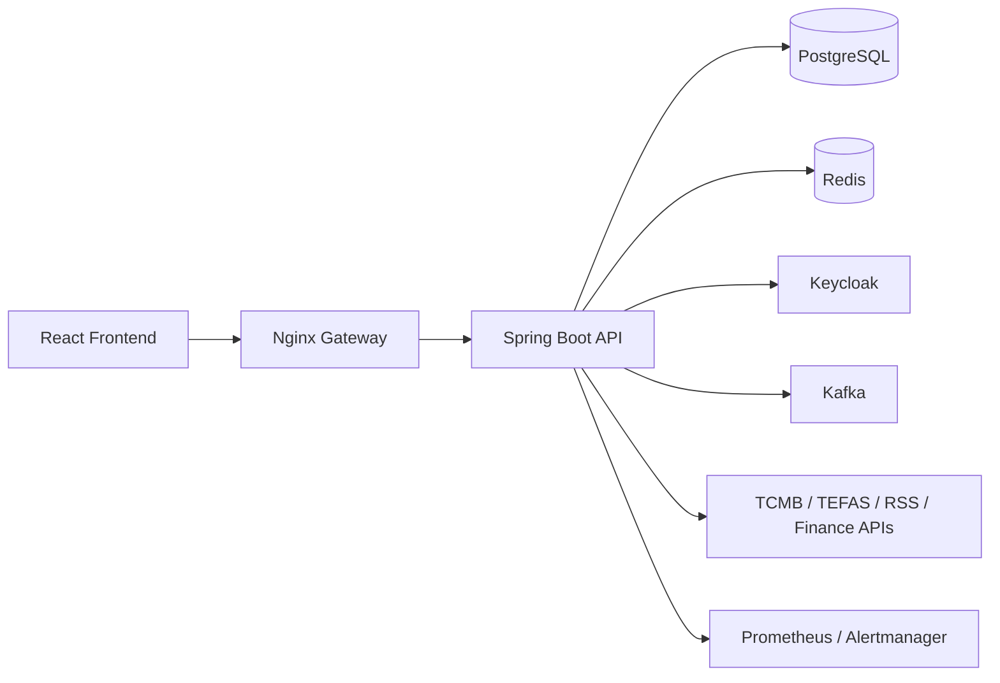

# MintStack Teknik Dokumantasyon

## Proje Kimligi

| Alan | Deger |
|---|---|
| Proje | MintStack Finance Portal |
| Tarih | 2026-05-14 |
| Backend | Java 17, Spring Boot 3.4.2 |
| Frontend | React 18, TypeScript 5.9, Vite 5 |
| DB | PostgreSQL 15, Flyway |
| Cache | Redis 7 |
| Auth | Keycloak 26 |

## Amac

Kullanicilarin portfoylerini, doviz/fon/hisse gibi finansal enstrumanlari, haberleri, alarmlari ve teknik analiz sinyallerini tek portal uzerinden takip etmesini saglamak.

## Kapsam

- Portfoy CRUD, nakit, alim/satim, emir yasam dongusu.
- Market data: TCMB, TEFAS, Yahoo/Alpha/Finnhub, RSS.
- Borsa/fon kavram sozlugu.
- Teknik analiz: RSI, MACD, Bollinger, SMA/EMA, Stochastic, ATR, ADX, OBV, VWAP, CCI, MFI, Williams %R.
- Admin: kullanici, rate limit, runtime settings, glossary, simulation, observability.
- CI/CD: backend/frontend test, compose validation, Docker smoke build.

## Mimari

## Modul Yapisi

| Modul | Backend | Frontend |
|---|---|---|
| Market Data | `MarketDataService`, `MarketDataScheduler` | `marketApi`, market pages |
| TEFAS | `TefasFundClient`, `TefasFundDataService` | Funds page |
| Doviz Portfolio | `MarketDataMaintenanceService`, `PortfolioService` | `CurrencyPage` |
| Glossary | `GlossaryService`, `GlossaryController` | `GlossaryPage`, `glossaryApi` |
| Haber Enrichment | `NewsEnrichmentService`, `NewsScheduler` | News feed card/summary consumption |
| Rate Limit | `RateLimitConfig`, `RateLimitFilter` | Admin API through backend |
| Technical Indicators | `TechnicalIndicatorService` | Analysis/indicator consumers |
| Alerts | `AlertWebhookController`, `AlertWebhookSecurityService` | Alerts page |
| Runtime Settings | `RuntimeSettingsService` | Admin future screen/API |

## API Kaynaklari

| Kaynak | Kullanim | Durum |
|---|---|---|
| TCMB | Resmi doviz kurlari | Aktif |
| TEFAS | Fon fiyatlari ve fon sozlugu kaynak bilgisi | Aktif |
| Yahoo Finance | Public fallback market data | Aktif |
| Alpha Vantage | US/FX fallback | API key gerekir |
| Finnhub | US/FX/Crypto fallback | API key gerekir |
| Fintables | BIST/fon/teknik veri icin adapter | Resmi pasif (policy lock) |
| RSS | Ulusal/uluslararasi haber | Aktif |
| LLM Enrichment | RSS haberini ozet/sentiment/anahtar kelime ile zenginlestirme | Aktiflenebilir (live) |

## Scheduler Guncelleme Planlari

| Veri | Cron | Not |
|---|---|---|
| TCMB | `APP_SCHEDULER_TCMB_RATES_CRON` | Hafta ici, resmi kur penceresi |
| Forex | `APP_SCHEDULER_FOREX_RATES_CRON` | 7/24 canli gerekmez |
| Hisse | `APP_SCHEDULER_STOCK_PRICES_CRON` | Dev ortamda sik, prod ortamda piyasa saatine gore |
| Fon | `APP_SCHEDULER_FUND_PRICES_CRON` | TEFAS/NAV icin gun sonu onerilir |
| VIOP | `APP_SCHEDULER_VIOP_PRICES_CRON` | Yuksek hassasiyet |
| Kripto | `APP_SCHEDULER_CRYPTO_PRICES_CRON` | 1 dk varsayilan |
| Haber | `APP_SCHEDULER_NEWS_FETCH_CRON` | 15 dk |

## Guvenlik

- OAuth2/OIDC: Keycloak JWT.
- RBAC: `USER`, `ADMIN`.
- Public read-only: market, news, glossary, OpenAPI, health.
- Admin-only: `/api/v1/admin/**`, simulation, runtime settings, rate limit, glossary CRUD.
- Rate limiting: Redis store varsayilan, memory fallback.
- Alert webhook hardening: CIDR allowlist + HMAC SHA-256 imza dogrulama (opsiyonel zorunlu mod).
- Secret yonetimi: `.env` ve environment variable tabanli.

## Ortam Degiskenleri

| Degisken | Aciklama |
|---|---|
| `APP_PUBLIC_BASE_URL` | OpenAPI server URL |
| `APP_RATE_LIMIT_STORE` | `redis` veya `memory` |
| `APP_RATE_LIMIT_*` | Limit degerleri |
| `APP_EXTERNAL_API_TEFAS_*` | TEFAS entegrasyon ayarlari |
| `APP_EXTERNAL_API_FINTABLES_ENABLED` | Fintables policy switch (varsayilan `false`) |
| `FINTABLES_BASE_URL`, `FINTABLES_API_KEY` | Fintables konfigurasyonu (yalniz policy aciksa) |
| `ALPHA_VANTAGE_API_KEY`, `FINNHUB_API_KEY` | Finance API keyleri |
| `APP_NEWS_*` | RSS haber ayarlari |
| `APP_NEWS_LLM_*` | LLM enrichment endpoint/model/key ayarlari |
| `APP_ALERT_WEBHOOK_*` | Alert webhook signature ve IP allowlist ayarlari |

## ER ve Diyagramlar

- ER: `docs/diagrams/er-diagram.mmd`
- Admin modul akisi: `docs/diagrams/admin-modules-flow.mmd`
- Market data sequence: `docs/diagrams/market-data-sequence.mmd`
- Alert sequence: `docs/diagrams/alert-sequence.mmd`

## CI/CD

GitHub Actions:

- Backend compile/test/verify.
- Flyway validate.
- Frontend lint/typecheck/test/build.
- Docker compose validation: dev, light, prod.
- Docker image smoke build.
- Playwright E2E.

## Kabul Kriterleri

- `./mvnw -DskipTests compile` basarili.
- `npm run typecheck` basarili.
- `docker compose -f docker-compose.light.yml config` basarili.
- Swagger pathleri gateway uzerinden erisilebilir.
- Doviz kurlari `CURRENCY` enstrumanina yazilir ve portfoy trade endpointi ile islenir.
- TEFAS fon verisi `FUND` enstrumanina ve `price_history` tablosuna yazilir.
