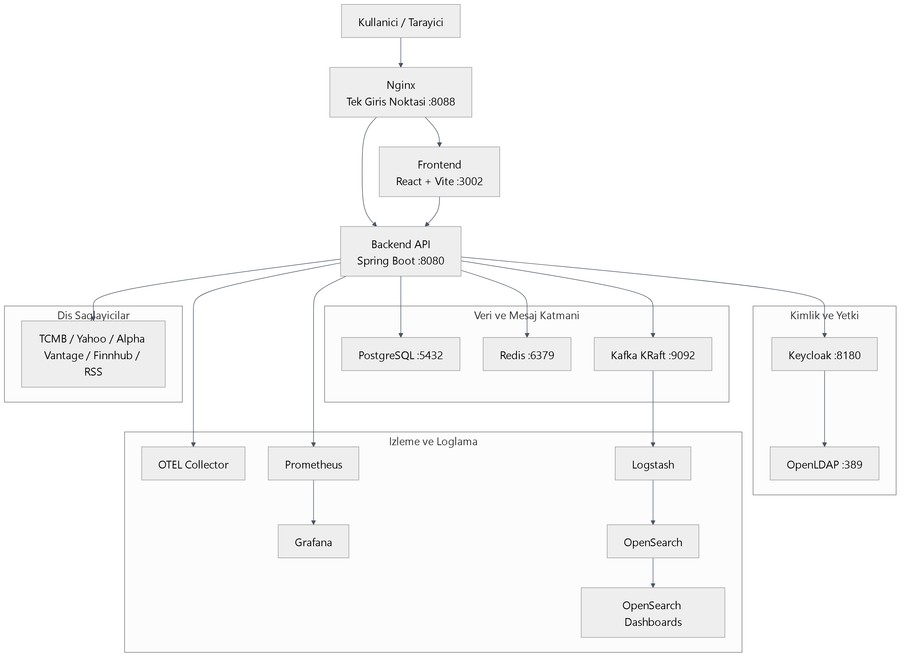
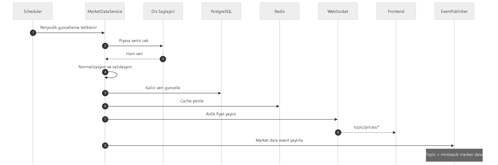
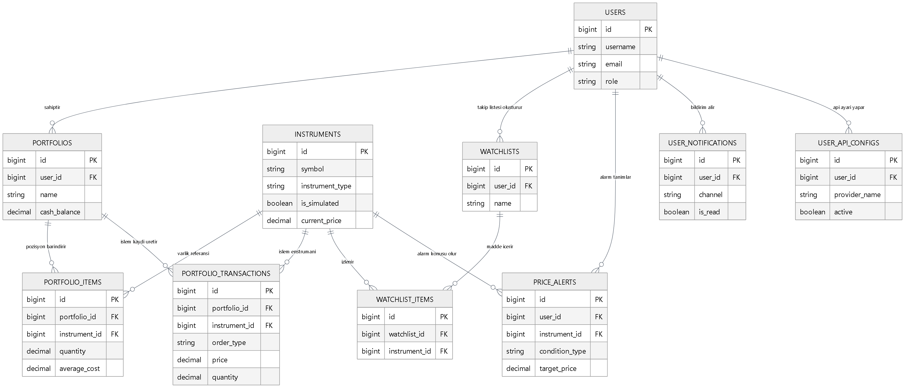
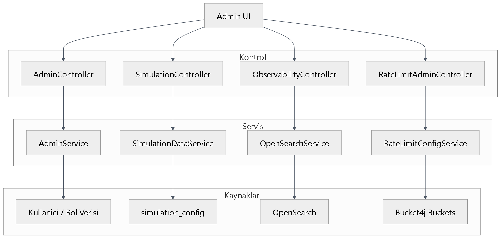
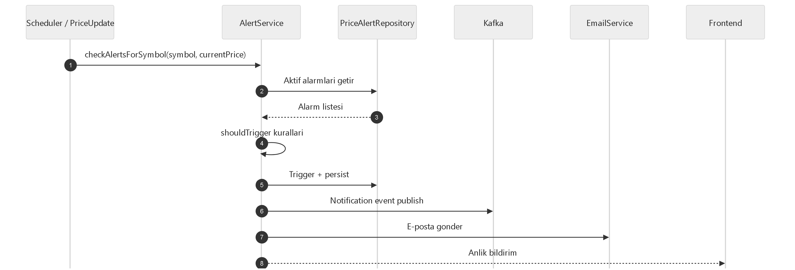

---
title: "MintStack Finance Portal"
subtitle: "Teknik Analiz, Mimari ve Modelleme Dokümanı"
author: "Mesut Taha Güven"
date: "23 Mayıs 2026"
lang: "tr-TR"
papersize: a4
geometry: margin=2.2cm
fontsize: 13pt
numbersections: false
---

<div style="height: 48px;"></div>

<div align="center">

# MintStack Finance Portal

## Teknik Analiz, Mimari ve Modelleme Dokümanı

**Sürüm:** 2.0
**Tarih:** 23 Mayıs 2026
**Hazırlayan:** Mesut Taha Güven

</div>

<div style="height: 88px;"></div>

<div align="center">

Teknik ve tasarımsal değerlendirme için hazırlanmıştır.

</div>

<div style="page-break-after: always;"></div>

## Belge Bilgileri

| Belge Alanı | Değer |
|---|---|
| Sürüm | 2.0 |
| Tarih | 23 Mayıs 2026 |
| Hazırlayan | Mesut Taha Güven |
| Doküman Türü | Teknik Analiz, Mimari ve Modelleme Dokümanı |
| Amaç | Teknik ve tasarımsal değerlendirme için referans belge |

### Teslim Güncellemesi

Bu sürüm 7 Haziran proje teslim isterlerine göre güncellenmiştir. Backend hedefi Java 21 olarak kilitlenmiş, OpenTelemetry OTLP trace aktarımı bağlanmış, Keycloak TOTP 2FA demo akışı hazırlanmış, Javadocs üretimi eklenmiş ve Finans Portalı kapsamındaki isterler `docs/DELIVERY_CHECKLIST.md` dosyasında kanıtlarıyla eşleştirilmiştir.

IT Servis - Ticket Yönetimi ve jBPM bu repo kapsamında değildir; sunumda kapsam dışı olarak belirtilir.

### İçindekiler

1. [Yönetici Özeti](#yonetici-ozeti)
2. [Kapsam](#kapsam)
3. [Terminoloji ve Standartlar](#terminoloji-ve-standartlar)
4. [Gereksinimler](#gereksinimler)
5. [Sistem Tasarımı](#sistem-tasarimi)
6. [Veri Akışı ve İş Kuralları](#veri-akisi-ve-is-kurallari)
7. [Güvenlik ve Yetkilendirme](#guvenlik-ve-yetkilendirme)
8. [Test ve Doğrulama](#test-ve-dogrulama)
9. [Riskler ve Kısıtlamalar](#riskler-ve-kisitlamalar)
10. [Referanslar](#referanslar)
11. [Ekler](#ekler)

### Belgenin Kullanımı

Bu doküman; ekip içi teknik hizalama, mimari karar doğrulama ve operasyonel değerlendirme amacıyla hazırlanmıştır. Belge içeriği; işlevsel kapsam, mimari yapı, veri akışları, güvenlik modeli, test yaklaşımı ve operasyonel gereksinimleri tek bir çatı altında toplar.

## 1) Yönetici Özeti {#yonetici-ozeti}

MintStack Finance Portal; piyasa verisi izleme, sanal portföy yönetimi, emir yaşam döngüsü, teknik analiz, simülasyon ve bildirim yeteneklerini aynı sistem içinde sunan modüler bir uygulamadır. Bu doküman, sistemin teknik çerçevesini uçtan uca tanımlar ve geliştirme ile operasyon ekipleri için referans görevi görür.

### 1.1 Dokümanın Amacı

- Sistem mimarisini, veri akışlarını, iş kurallarını ve teknik kararları netleştirmek.
- Gereksinimleri test edilebilir ve izlenebilir biçimde belgelemek.
- Güvenlik, performans ve operasyonel işletim yaklaşımını açık hale getirmek.
- Sonraki iterasyonlar için teknik borç ve iyileştirme alanlarını görünür kılmak.

### 1.2 Sistem Özeti

MintStack Finance Portal:

- Türkiye odaklı finans verisi izleme platformudur.
- Döviz, hisse, tahvil/bono, fon, VİOP, endeks ve kripto verilerini yönetir.
- Sanal portföy, emir yönetimi (MARKET/LIMIT/STOP), teknik analiz, simülasyon ve bildirim yetenekleri sunar.
- OAuth2/OIDC (Keycloak), RBAC, 2FA, gözlemlenebilirlik ve log analizi gereksinimlerini karşılayacak şekilde yapılandırılır.

### 1.3 Başarı Kriterleri

- Kullanıcı, tek bir arayüzden piyasa verisi + portföy + teknik analiz + haber akışını görebilmelidir.
- Gerçek veri yoksa simülasyon verisi üretimi kesintisiz devam etmelidir.
- Simülasyon kaynaklı veriler kullanıcıya açık biçimde işaretlenmelidir.
- Kritik işlevler (emir işleme, kimlik doğrulama, veri toplama) test edilebilir olmalıdır.

---

## 2) Kapsam {#kapsam}

### 2.1 Kapsam Dahili

Bu doküman aşağıdaki alanları kapsar:

- Frontend (React + TypeScript + Vite) sayfaları ve API tüketim katmanı.
- Backend (Spring Boot) controller/service/repository katmanları.
- Portföy yönetimi ve emir yaşam döngüsü.
- Teknik analiz API’leri (MA, trend, RSI, MACD, Bollinger, Stochastic).
- Simülasyon motoru (fiyat + haber + rastgele piyasa olayları).
- Veri kaynakları (TCMB, Yahoo, Alpha Vantage, Finnhub) ve sağlayıcı seçimi.
- Cache, mesajlaşma, loglama ve gözlemlenebilirlik (Redis, Kafka, OpenSearch, Prometheus, Grafana, OTEL).
- Kimlik ve yetki altyapısı (Keycloak + OpenLDAP).
- Docker Compose ile geliştirme ve üretim topolojisi.

### 2.2 Kapsam Harici

- Mobil uygulama geliştirmesi.
- Algoritmik yüksek frekanslı işlem (HFT) motoru.
- Gerçek para ile canlı emir iletimi ve aracı kurum entegrasyonu.
- Yasal uyum (SPK/MiFID) denetim süreçlerinin tam otomasyonu.
- Kubernetes tabanlı dağıtım (mevcut durumda Docker Compose ana akış).

### 2.3 Varsayımlar

- Dış API’lerde dönemsel kesintiler olabilir; sistem yedek akış ve simülasyon ile çalışmayı sürdürür.
- Geliştirme ortamı tek makinede Docker ile ayağa kalkar.
- Kullanıcılar OIDC tabanlı login akışını kullanır.

### 2.4 Teknoloji Yığını ve Sürüm Matrisi

Bu bölümdeki sürümler proje dosyalarından doğrulanmıştır (`backend/pom.xml`, Maven dependency tree, `frontend/package.json`/lockfile, `docker-compose*.yml`).

| Katman | Teknoloji | Sürüm |
|---|---|---|
| Backend | Java | 17 |
| Backend | Spring Boot | 3.4.2 |
| Backend | Spring Security Config | 6.4.2 |
| Backend | Spring Data JPA | 3.4.2 |
| Backend | Spring Kafka | 3.3.2 |
| Backend | Spring WebSocket / WebFlux | 6.2.2 / 6.2.2 |
| Backend | Flyway | 10.20.1 |
| Backend | Resilience4j / Bucket4j | 2.2.0 / 8.7.0 |
| Backend | Quartz / Log4j2 JSON Layout | 2.3.2 / 2.24.3 |
| Frontend | React / React DOM | 18.3.1 / 18.3.1 |
| Frontend | TypeScript / Vite | 5.9.3 / 5.4.21 |
| Frontend | Redux Toolkit | 2.11.2 |
| Frontend | React Router DOM | 6.30.3 |
| Frontend | Tailwind CSS | 3.4.19 |
| Frontend | Keycloak JS | 26.2.3 |
| Frontend | STOMP.js / SockJS | 7.2.1 / 1.6.1 |
| Frontend | i18next / Recharts | 23.16.8 / 2.15.4 |
| Test | Vitest / Coverage V8 | 1.6.1 / 1.6.1 |
| Test | Playwright / Testcontainers | 1.57.0 / 1.19.3 |
| Altyapı | PostgreSQL / Redis | 15-alpine / 7-alpine |
| Altyapı | Keycloak / OpenLDAP | 26.5.4 / 1.5.0 |
| Altyapı | Kafka (KRaft) | 7.5.0 |
| Altyapı | OpenSearch / Dashboards | 2.13.0 / 2.13.0 |
| Altyapı | Logstash / OTEL Collector | 8.9.0 / 0.91.0 |
| Altyapı | Prometheus / Grafana / AlertManager | 2.48.0 / 10.2.2 / 0.26.0 |

---

## 3) Terminoloji ve Standartlar {#terminoloji-ve-standartlar}

### 3.1 Terminoloji

| Terim | Açıklama |
|---|---|
| API Gateway | Nginx ile tek giriş noktası (`:8088`) |
| OIDC | OpenID Connect kimlik katmanı |
| RBAC | Role-Based Access Control |
| STOMP | WebSocket mesajlaşma protokolü |
| KRaft | Zookeeper’sız Kafka çalışma modu |
| Simülasyon Verisi | Gerçek dış kaynak yerine sistemin ürettiği veri |
| isSimulated | Enstrümanın simüle edildiğini belirten alan |
| MARKET/LIMIT/STOP | Emir tipleri |

### 3.2 Kod ve Mimari Standartları

- Backend: Katmanlı mimari (`controller -> service -> repository`).
- Frontend: Fonksiyonel bileşenler + hook’lar + RTK Query.
- API sözleşmeleri: `/api/v1/...` versiyonlu URL yaklaşımı.
- Veri modeli: Flyway migrasyonları ile yönetilir (19+ migration).
- Log formatı: Yapısal log + merkezi indeksleme (OpenSearch).

### 3.3 İsimlendirme Kuralları

- Endpoint: çoğul kaynak adı (`/portfolios`, `/market/stocks`).
- Entity alanları: anlaşılır, alan odaklı.
- Testler: `*Test.java`, `*.test.ts(x)` kalıbı.
- Ortam değişkenleri: `UPPER_SNAKE_CASE`.

### 3.4 Hata Standardı

Hata yanıtı JSON formatı:

```json
{
  "timestamp": "2026-03-05T12:30:00",
  "status": 400,
  "error": "Bad Request",
  "message": "Validasyon hatası",
  "path": "/api/v1/portfolios/{id}/trades"
}
```

---

## 4) Gereksinimler {#gereksinimler}

### 4.1 Fonksiyonel Gereksinimler

| ID | Gereksinim | Kabul Kriteri |
|---|---|---|
| FR-001 | Sistem, kullanıcıyı Keycloak ile doğrulamalıdır. | Geçerli JWT ile korumalı endpoint erişimi sağlanır. |
| FR-002 | Sistem, rol bazlı yetkilendirme uygulamalıdır. | `ADMIN` endpoint’leri `USER` için 403 döner. |
| FR-003 | Sistem, kullanıcıya portföy oluşturma/güncelleme/silme sunmalıdır. | CRUD işlemleri API üzerinden tamamlanır. |
| FR-004 | Sistem, MARKET emrini anında işleyebilmelidir. | Uygun koşulda emir `FILLED` olur. |
| FR-005 | Sistem, LIMIT emrini tetik şartına göre işlemelidir. | Fiyat koşulu oluşmadan emir `PENDING` kalır. |
| FR-006 | Sistem, STOP emrini tetik şartına göre işlemelidir. | Stop seviyesi aşılınca emir işlenir. |
| FR-007 | Sistem, işlem sonrası nakit ve pozisyonları güncellemelidir. | `cashBalance`, `PortfolioItem`, `Transaction` tutarlı değişir. |
| FR-008 | Sistem, fiyat verisini periyodik toplamalıdır. | Scheduler belirlenen aralıkta veri çeker. |
| FR-009 | Sistem, dış API yokluğunda simülasyon modunu desteklemelidir. | Simülasyon aktifken veri üretimi sürer. |
| FR-010 | Sistem, simülasyon verisini kullanıcıya görünür işaretlemelidir. | UI’da simülasyon etiketi/işareti görünür. |
| FR-011 | Sistem, döviz kurlarını TCMB’den çekebilmelidir. | `/market/currencies` güncel kayıt döner. |
| FR-012 | Sistem, hisse/fon/tahvil/VİOP verisini sağlayıcı zinciri ile almalıdır. | Yedek sağlayıcı akışı ile veri üretimi sürer. |
| FR-013 | Sistem, WebSocket ile anlık fiyat yayını yapmalıdır. | `topic/prices/*` kanalları üzerinden yayın yapılır. |
| FR-014 | Sistem, haber akışı sağlamalıdır. | `/news` endpoint’i sayfalı veri döner. |
| FR-015 | Sistem, simülasyon haberini gerçek haberden ayırt etmelidir. | Simülasyon kaynak adı/işaretleme bulunur. |
| FR-016 | Sistem, teknik analiz göstergelerini hesaplamalıdır. | RSI/MACD/Bollinger/Stochastic endpoint’leri çalışır. |
| FR-017 | Sistem, enstrüman karşılaştırma analizi yapmalıdır. | `/analysis/compare` sonuç listesi döner. |
| FR-018 | Sistem, alarm kuralları ve bildirim üretmelidir. | Fiyat alarmı tetiklenince bildirim oluşur. |
| FR-019 | Sistem, kullanıcı tercihlerine göre veri kaynağı yönetebilmelidir. | `/data-sources/preferences` ile güncelleme yapılır. |
| FR-020 | Sistem, log event’lerini merkezi saklamalıdır. | Kafka -> Logstash -> OpenSearch akışı işler. |
| FR-021 | Sistem, market-data event’lerini de tüketebilmelidir. | `MarketDataEventConsumer` event’i işler ve indeksler. |
| FR-022 | Sistem, portföyü Excel/PDF olarak dışa aktarabilmelidir. | Export endpoint’leri dosya yanıtı döner. |
| FR-023 | Sistem, admin panelinden simülasyon kontrolü sunmalıdır. | Simülasyon start/stop/config endpoint’leri çalışır. |
| FR-024 | Sistem, çoklu dil ve tema desteği sunmalıdır. | TR/EN ve tema anahtarlama işlevsel olmalıdır. |

### 4.2 Non-Fonksiyonel Gereksinimler

| ID | Alan | Hedef |
|---|---|---|
| NFR-001 | Güvenlik | OAuth2/OIDC + JWT + RBAC zorunlu |
| NFR-002 | Güvenlik | 2FA (TOTP) aktiflenebilir yapı |
| NFR-003 | Performans | Okuma endpoint’lerinde hedef P95 < 800ms (50 RPS, 200 eşzamanlı kullanıcı, 15 dk sabit yük) |
| NFR-004 | Performans | Yazma endpoint’lerinde hedef P95 < 1500ms (10 RPS, 100 eşzamanlı kullanıcı, 15 dk sabit yük) |
| NFR-005 | Ölçeklenebilirlik | Üretimde backend replica desteği |
| NFR-006 | Dayanıklılık | Dış API çağrılarında retry + circuit breaker |
| NFR-007 | Gözlemlenebilirlik | Prometheus metrikleri + Grafana panoları |
| NFR-008 | Gözlemlenebilirlik | Loglar OpenSearch üzerinden sorgulanabilir |
| NFR-009 | İzlenebilirlik | Tracing altyapısı OTEL üzerinden çalışmalı |
| NFR-010 | Bakım Kolaylığı | Flyway ile şema versiyonlaması |
| NFR-011 | Operasyon | Docker Compose ile tek komutta kurulum |
| NFR-012 | Kod Kalitesi | CI hattında backend/frontend testleri, lint ve build adımları hatasız tamamlanmalı |

### 4.2.1 Ölçüm Koşulları

- Performans ölçümleri için test verisi önceden yüklenmiş veritabanı ve ısınma süresi (en az 5 dakika) kullanılır.
- P95 hedefleri en az 15 dakikalık steady-state yük altında doğrulanır.
- Ölçümler aynı sürüm için en az 3 tekrar çalıştırılarak medyan değer üzerinden raporlanır.

### 4.3 Gereksinim İzlenebilirliği (Örnek)

| Gereksinim | Endpoint/Modül | Test Alanı |
|---|---|---|
| FR-004/5/6 | `POST /portfolios/{id}/trades` + order engine | `PortfolioOrderExecutionServiceTest` |
| FR-016 | `/api/v1/indicators/*` | Teknik gösterge servis testleri |
| FR-009/10 | `SimulationDataService` + UI market kartları | Simülasyon entegrasyon testleri |
| FR-021 | `MarketDataEventConsumer` | Kafka tüketici testleri |

---

## 5) Sistem Tasarımı {#sistem-tasarimi}

### 5.1 Mimari Yaklaşım

Sistem, **modüler monolith + servis odaklı katmanlama** yaklaşımıyla tasarlanmıştır:

- Tek backend uygulaması içinde domain bazlı servisler.
- Ayrık sorumluluk: piyasa verisi, portföy, analiz, simülasyon, kullanıcı.
- Dış sistemlerle gevşek bağlı entegrasyon (WebClient + sağlayıcı çözümleyici).

### 5.2 Üst Seviye Mimari (Container Görünümü)



### 5.3 Backend Modül Tasarımı

| Modül | Sorumluluk |
|---|---|
| `controller` | REST endpoint tanımı, request doğrulama |
| `service` | İş kuralları ve orkestrasyon |
| `repository` | Kalıcı veri erişimi |
| `scheduler` | Periyodik veri toplama/simülasyon |
| `service/event` | Kafka publish/consume |
| `service/simulation` | Simülasyon motoru ve haber senaryoları |
| `service/portfolio` | Emir tetikleme, komisyon, nakit/pozisyon yönetimi |

### 5.4 Veri Tabanı Tasarımı (Özet)

Ana varlıklar:

- `users`, `user_api_configs`, `user_data_preferences`
- `portfolios`, `portfolio_items`, `portfolio_transactions`
- `instruments`, `price_history`, `currency_rates`
- `watchlists`, `watchlist_items`, `price_alerts`
- `news`, `news_categories`, `user_notifications`
- `simulation_config`

Öne çıkan tasarım kararı:

- `instruments` tablosunda `(symbol, is_simulated)` unique kuralı ile gerçek/simüle veri ayrımı güvence altına alınmıştır.

### 5.5 Entegrasyon Tasarımı

| Entegrasyon | Protokol | Amaç |
|---|---|---|
| Frontend -> Backend | HTTP/JSON | İşlevsel API erişimi |
| Frontend <-> Backend | WebSocket/STOMP | Anlık fiyat güncellemesi |
| Backend -> Keycloak | OIDC/JWK | Token doğrulama |
| Backend -> Dış API | HTTPS | Piyasa verisi toplama |
| Backend -> Kafka | Event | Log/bildirim/market data event |
| Kafka -> Logstash | Event tüketimi | Log işleme |
| Logstash -> OpenSearch | HTTP | Log indeksleme |
| Backend -> OTEL | OTLP | Trace/metrik akışı |

### 5.6 API Sözleşmeleri

- Base URL: `http://localhost:8088/api/v1`
- Auth: `Authorization: Bearer <token>`
- Versiyonlama: URL bazlı (`/api/v1`)
- Teknik analiz endpoint örnekleri:
  - `GET /analysis/ma/{symbol}`
  - `GET /analysis/trend/{symbol}`
  - `POST /analysis/compare`
  - `GET /indicators/rsi/{symbol}`
  - `GET /indicators/macd/{symbol}`
  - `GET /indicators/bollinger/{symbol}`
  - `GET /indicators/stochastic/{symbol}`
  - `GET /indicators/all/{symbol}`

### 5.7 Dağıtım Tasarımı

Dağıtım profilleri:

- `docker-compose.yml`: tam geliştirme stack’i.
- `docker-compose.light.yml`: düşük kaynaklı geliştirme.
- `docker-compose.prod.yml`: production topolojisi (secret + network segmentasyonu + replica).

---

## 6) Veri Akışı ve İş Kuralları {#veri-akisi-ve-is-kurallari}

### 6.1 Gerçek Piyasa Verisi Akışı



### 6.2 Simülasyon Veri Akışı

Simülasyon aktif olduğunda:

- Dış API çağrısı yerine simülasyon motoru fiyat üretir.
- Hisse + tahvil + fon + VİOP + döviz + endeks + kripto için cache güncellenir.
- Senaryo temelli haber üretimi yapılır.
- Üretilen veriler `isSimulated` veya kaynak adı üzerinden işaretlenir.

### 6.3 Kritik İş Kuralları

#### 6.3.1 Emir Kuralları

- MARKET emirleri uygun fiyat varsa doğrudan işlenir.
- LIMIT BUY: `marketPrice <= limitPrice` olursa tetiklenir.
- LIMIT SELL: `marketPrice >= limitPrice` olursa tetiklenir.
- STOP BUY: `marketPrice >= stopPrice` olursa tetiklenir.
- STOP SELL: `marketPrice <= stopPrice` olursa tetiklenir.
- Non-market emirlerde BIST seansı kontrol edilir.
- Kripto enstrümanlarda seans kısıtı uygulanmaz.

#### 6.3.2 Portföy ve Nakit Kuralları

- Yetersiz nakitte BUY emri reddedilir veya uygun miktara düşürülür.
- SELL işleminde FIFO lot tüketimi uygulanır.
- Komisyon + vergi enstrüman tipine göre çarpanlı hesaplanır.
- İşlem sonrası `cashBalance`, `filledQuantity`, `realizedPnL` güncellenir.

#### 6.3.3 Teknik Analiz Kuralları

- RSI: varsayılan periyot 14.
- MACD: varsayılan 12/26/9.
- Bollinger: varsayılan 20 ve 2.0 std-dev.
- Stochastic: varsayılan `%K=14`, `%D=3`.
- Tüm gösterge endpoint’leri yetersiz veri durumunda açıklayıcı mesaj döner.

#### 6.3.4 Veri Kaynağı Kuralı (Önemli)

- TCMB yalnızca döviz için birincil kaynaktır.
- BIST 100 gibi endeksler TCMB’den gelmez; Yahoo/AlphaVantage/Finnhub veya simülasyon/yedek akıştan gelir.
- Bu nedenle TCMB anahtarı çalışsa bile endeks tarafında ayrı sağlayıcı gereklidir.

### 6.4 Validasyon ve Hata Yönetimi

- DTO seviyesinde alan zorunluluk ve format kontrolleri.
- Servis katmanında iş kuralı ihlalleri `BadRequest`/domain exception ile yönetilir.
- Tüm hatalar standardize JSON formatta döndürülür.

---

## 7) Güvenlik ve Yetkilendirme {#guvenlik-ve-yetkilendirme}

### 7.1 Kimlik Doğrulama

- Keycloak realm: `mintstack-finance`
- Frontend: PKCE tabanlı login akışı
- Backend: JWT imza doğrulama (issuer + jwk-set)
- Opsiyonel 2FA (TOTP) desteği

### 7.2 Yetkilendirme

| Rol | Yetki Kapsamı |
|---|---|
| USER | Portföy, piyasa, alarm, watchlist, analiz |
| ADMIN | USER + admin paneli + simülasyon yönetimi |

### 7.3 Uygulama Güvenlik Önlemleri

- Spring Security ile endpoint bazlı erişim kontrolü.
- CORS whitelist yaklaşımı uygulanır; geliştirme ortamında izinli originler `http://localhost:3000/3001/3002/8088` ve karşılık gelen `127.0.0.1` adresleri ile sınırlandırılmıştır.
- Rate limiting (Bucket4j) ile suistimal önleme.
- Secret’lar `.env`/Docker secrets üzerinden taşınır.
- Kafka SASL/PLAIN ve OpenSearch security açık yapı.

### 7.4 Operasyonel Güvenlik

- Üretimde iç servis ağ segmentasyonu (`internal` network).
- Nginx tek giriş noktası.
- Prometheus/Grafana/OpenSearch erişimi kimlik doğrulamalı.

---

## 8) Test ve Doğrulama {#test-ve-dogrulama}

### 8.1 Mevcut Test Varlığı

- Backend test sınıfı: **41**
- Frontend test dosyası: **25**
- Flyway migration: **19+**

### 8.1.1 Kalite Kapıları

- Kritik iş akışları (kimlik doğrulama, emir işleme, piyasa verisi güncelleme, alarm tetikleme) için en az bir otomatik test bulunur.
- CI hattında test adımı başarısızsa paketleme ve dağıtım adımları çalıştırılmaz.
- Lint adımı için hata eşiği `0` olarak kabul edilir.

### 8.2 Test Stratejisi

| Katman | Araç | Amaç |
|---|---|---|
| Unit (Backend) | JUnit5 + Mockito | İş kuralı doğrulama |
| Unit (Frontend) | Vitest + Testing Library | Bileşen/logic testi |
| Entegrasyon | Spring Test + Testcontainers | DB/Kafka/Redis entegrasyonu |
| E2E (Frontend) | Playwright | Kullanıcı senaryoları |
| API doğrulama | Swagger + manuel/otomatik çağrı | Sözleşme doğruluğu |

### 8.3 Kritik Test Senaryoları

| ID | Senaryo | Beklenen |
|---|---|---|
| TS-001 | STOP BUY tetikleme | Fiyat stop üstüne çıkınca emir işlenir |
| TS-002 | STOP SELL tetikleme | Fiyat stop altına inince emir işlenir |
| TS-003 | Seans dışı non-crypto emir | Emir `PENDING` kalır |
| TS-004 | Simülasyon açıkken veri üretimi | Piyasa kartları boş kalmaz |
| TS-005 | RSI/MACD/Bollinger/Stochastic endpoint | 200 + anlamlı veri |
| TS-006 | Simülasyon haber işareti | UI’da simülasyon etiketi görünür |
| TS-007 | Market data event consume | Event OpenSearch’e yazılır |
| TS-008 | Role enforcement | USER, ADMIN endpoint’e erişemez |

### 8.4 Çalıştırma Komutları

```bash
# Backend
cd backend
./mvnw clean verify

# Frontend
cd frontend
npm run lint
npm run test -- --run --coverage
npm run build
```

### 8.5 Kabul Kriterleri

- Build kırılmadan tamamlanmalı.
- Kritik iş akışları (auth, market data, portfolio orders, analysis) en az birer test ile doğrulanmalı.
- CI akışında test + build + paketleme adımları yeşil olmalı.

---

## 9) Riskler ve Kısıtlamalar {#riskler-ve-kisitlamalar}

### 9.1 Risk Tablosu

| Risk | Olasılık | Etki | Azaltım Planı |
|---|---|---|---|
| Dış API rate limit/kesinti | Orta | Yüksek | Retry + yedek akış + simülasyon |
| Büyük servis sınıfları | Orta | Orta | Domain servislerine daha fazla bölme |
| TypeScript strict gevşekliği | Orta | Orta | Aşamalı strict migration |
| Operasyonel kaynak tüketimi | Orta | Orta | hafif geliştirme profili + servis ayrıştırma |
| CORS yanlış yapılandırma | Düşük | Yüksek | Ortam bazlı whitelist |
| Gözlemlenebilirlik yanlış alarm | Orta | Düşük | Alert threshold tuning |
| Veri tutarlılığı (cache/DB) | Düşük | Orta | TTL + invalidation stratejisi |

### 9.2 Kısıtlamalar

- Geliştirme ortamında tek makine kaynakları sınırlayıcıdır.
- Dış API anahtarlarının geçerliliği/veri kotası sistem davranışını etkiler.
- Finansal veri çeşitliliği sağlayıcı kapsamı ile sınırlıdır.

### 9.3 Teknik Borç ve Önceliklendirme

| İş Kalemi | Öncelik | Hedef Zaman |
|---|---|---|
| Büyük servislerin domain bazlı ayrıştırılması | P1 | 2 sprint |
| Frontend strict TypeScript geçişi | P1 | 2 sprint |
| Performans testlerinin CI hattına kalıcı entegrasyonu | P2 | 1 sprint |
| Üretim güvenlik sertleştirmesi (CORS, actuator erişimi, secret yönetimi) | P1 | 1 sprint |

---

## 10) Referanslar {#referanslar}

- OAuth 2.0 Authorization Framework (RFC 6749)
- JSON Web Token (JWT) (RFC 7519)
- OpenID Connect Core 1.0
- OWASP ASVS 4.0.3
- OpenTelemetry Specification (Trace Context ve OTLP)

---

<div style="page-break-after: always;"></div>

## 11) Ekler {#ekler}
### Ek) Operasyonel Mimari Detayları

#### B.1 OpenAPI / Swagger Erişim Kontrol Listesi

Geliştirme ortamı adresleri:

- Swagger UI: `http://localhost:8088/swagger-ui.html`
- OpenAPI JSON: `http://localhost:8088/api-docs`
- Geriye dönük uyumluluk: `http://localhost:8088/v3/api-docs`

Teknik düzeltme özeti:

- `springdoc.api-docs.path` backend tarafında `/api-docs` olarak tanımlıydı.
- Nginx geliştirme konfigürasyonu yalnızca `/v3/api-docs/` yolunu proxy'liyordu.
- Çözüm olarak Nginx'e `/api-docs` route'u eklendi, security tarafında da `/v3/api-docs/**` uyumluluğu korundu.

#### B.2 Scheduler Frekans Planı (Enstrüman Bazlı)

| Veri Türü | Cron | Gerekçe |
|---|---|---|
| TCMB döviz | `0 30 10,16 * * MON-FRI` | Resmi yayın ritmi |
| BIST hisse | `*/20 * * * * *` | Gün içi değişim yüksek |
| Tahvil/bono | `0 */2 * * * *` | Daha düşük frekans yeterli |
| Yatırım fonu | `0 */3 * * * *` | Fon fiyatları daha yavaş güncellenir |
| VİOP | `*/30 * * * * *` | Kontrat bazlı daha sık izleme gerekir |
| Döviz (TCMB dışı) | `0 */5 * * * MON-FRI` | Rate limit ve tazelik dengesi |
| Kripto | `0 * * * * *` | 7/24 açık piyasa |
| Haber | `0 */15 * * * *` | Yeterli içerik tazeliği |

İlave tasarım kararları:

- Batch boyutu yapılandırılabilir: `APP_SCHEDULER_INSTRUMENT_BATCH_SIZE`
- Cron değerleri `application.yml` ve ortam değişkenleri ile üzerine yazılabilir.
- Round-robin offset artık tip bazlı tutulduğu için farklı enstrüman tipleri arasında kayma oluşmaz.

#### B.3 Teknik Göstergeler Tasarım Planı

Hesaplanan göstergeler:

- RSI
- MACD
- Bollinger Bands
- Stochastic
- SMA / EMA

Endpoint grubu:

- `/api/v1/indicators/rsi/{symbol}`
- `/api/v1/indicators/macd/{symbol}`
- `/api/v1/indicators/bollinger/{symbol}`
- `/api/v1/indicators/stochastic/{symbol}`
- `/api/v1/indicators/all/{symbol}`

Tasarım ilkeleri:

- Yetersiz veri durumunda kontrollü hata veya açıklayıcı mesaj dönüşü verilir.
- Periyotlar parametre ile değiştirilebilir yapıdadır.
- UI tarafında sekmeli gösterim ve grafik destekli görselleştirme hedeflenir.
- Çıktı yalnızca sayısal değer değil, yorumlanabilir sinyal alanlarını da taşımalıdır.

#### B.4 Yetki Matrisi (Admin / User / Public)

| Kaynak | Public | USER | ADMIN |
|---|---:|---:|---:|
| `GET /api/v1/market/**` | Evet | Evet | Evet |
| `GET /api/v1/news/**` | Evet | Evet | Evet |
| `GET /swagger-ui/**`, `GET /swagger-ui.html` | Evet | Evet | Evet |
| `GET /api-docs/**`, `GET /v3/api-docs/**` | Evet | Evet | Evet |
| `GET /actuator/health/**`, `GET /actuator/info` | Evet | Evet | Evet |
| `GET /actuator/prometheus` | Evet | Evet | Evet |
| Portföy / watchlist / alerts / users | Hayır | Evet | Evet |
| `/api/v1/data-sources/**` | Hayır | Evet | Evet |
| `/api/v1/simulation/**` | Hayır | Hayır | Evet |
| `/api/v1/admin/**` | Hayır | Hayır | Evet |

#### B.5 ER Diyagramı



DB tasarım notları:

- UUID tabanlı kimliklendirme kullanılır.
- Optimistic locking için `version` alanı bulunur.
- Şema yönetimi Flyway ile yapılır.
- İşlem ve geçmiş tabloları analitik kullanım senaryoları düşünülerek saklanır.

#### B.6 Yönetim Modülleri Bileşen Diyagramı



#### B.7 Rate Limiting Entegrasyonu

Mimari:

- `RateLimitFilter` global giriş filtresi olarak çalışır.
- Bucket4j token-bucket modeli kullanılır.
- Anonymous (IP), kullanıcı ve admin için ayrı limit profilleri tanımlanır.
- `/actuator/**`, `/swagger-ui/**` ve `/api-docs/**` yolları rate limit dışında bırakılır.

Runtime yönetimi:

- `GET /api/v1/admin/rate-limit`
- `PUT /api/v1/admin/rate-limit`

Örnek güncelleme payload'ı:

```json
{
  "enabled": true,
  "anonymousRequestsPerMinute": 120,
  "authenticatedRequestsPerMinute": 300,
  "adminRequestsPerMinute": 900,
  "clearBuckets": true
}
```

#### B.8 Alarm Akışı ve İş Kuralları



Temel iş kuralları:

- `PRICE_ABOVE`, `PRICE_BELOW`, `PERCENT_UP`, `PERCENT_DOWN` tipleri desteklenir.
- Tetiklenen alarm tekrar tetiklenmez (`isActive=false`, `isTriggered=true`).
- Kullanıcı başına aktif alarm limiti uygulanır.
- Tetiklenen alarm hem kalıcı olarak saklanır hem de bildirim kanalına düşer.

#### B.9 Hata Analizi (RSS dahil)

RSS ve harici servis hatalarında:

- Feed bazında hata izole edilir; tek bir RSS kaynağı başarısız olsa bile diğer kaynaklar işlenmeye devam eder.
- Circuit breaker yedek akışı devreye girerse son yayımlanmış haberler veritabanından okunarak boş ekran riski azaltılır.
- `source_url` ve `external_hash` alanları ile mükerrer haber kaydı engellenir.
- Simülasyon modu açık ve gerçek haber çekimi kapalıysa scheduler kontrollü şekilde gerçek RSS çekimini atlar.
- Scheduler job istisnayı loglar, tüm zamanlayıcı zinciri durmaz, bir sonraki çevrimde yeniden denenir.

Standart hata cevapları:

- `BAD_REQUEST`
- `RESOURCE_NOT_FOUND`
- `BUSINESS_RULE_VIOLATION`
- `RATE_LIMIT_EXCEEDED`
- `INTERNAL_SERVER_ERROR`

#### B.10 Trace ID / OpenTelemetry Kontrol Standardı

Standart:

- Header: `X-Trace-Id`
- Format: 32 karakter küçük harf hexadecimal
- Log bağlama: `%X{traceId}`

Uygulama:

- `TraceIdResponseFilter` her istekte trace id değerini normalize eder.
- 16 hex gelen trace id değeri 32 hex formata pad edilir.
- Geçersiz format tespit edilirse yeni trace id üretilir.
- Aynı trace id hem yanıt başlığı tarafında hem log tarafında izlenebilir olmalıdır.

#### B.11 Minimum Sistem İhtiyacı

Tam geliştirme ortamı:

- CPU: 4 vCPU minimum, 6 vCPU önerilen
- RAM: 8 GB minimum, 12 GB önerilen
- Disk: 20 GB boş alan

Düşük kaynak profili:

- Gözlemlenebilirlik yığını kapatıldığında daha düşük RAM ile çalışabilir.

