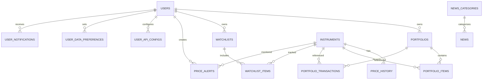
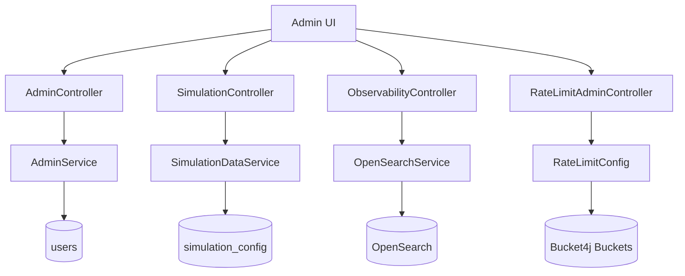
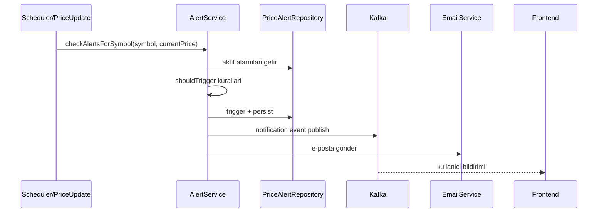

# Teknik Analiz Dokümanı - MintStack Finance Portal

**Sürüm:** 2.0  
**Tarih:** 05 Mart 2026  
**Hazırlayan:** Proje Ekibi  
**Doküman Türü:** Teknik Analiz, Mimari ve Modelleme Dokümanı

---

## 1) Özet

Bu doküman, MintStack Finance Portal projesinin teknik analizini uçtan uca tanımlar. Amaç; toplantı, jüri değerlendirmesi ve geliştirme sürecinde tüm ekiplerin tek bir teknik referans üzerinde hizalanmasını sağlamaktır.

### 1.1 Amaç

- Sistem mimarisini, veri akışlarını, iş kurallarını ve teknik kararları netleştirmek.
- Gereksinimleri test edilebilir ve izlenebilir biçimde belgelemek.
- Güvenlik, performans ve operasyonel işletim yaklaşımını açık hale getirmek.
- Sonraki iterasyonlar için teknik borç ve iyileştirme alanlarını görünür kılmak.

### 1.2 Sistem Tanımı

MintStack Finance Portal:

- Türkiye odaklı finans verisi izleme platformudur.
- Döviz, hisse, tahvil/bono, fon, VİOP, endeks ve kripto verilerini yönetir.
- Sanal portföy, emir yönetimi (MARKET/LIMIT/STOP), teknik analiz, simülasyon ve bildirim yetenekleri sunar.
- OAuth2/OIDC (Keycloak), RBAC, 2FA, observability ve log analizi ile kurumsal seviyede çalışır.

### 1.3 Başarı Kriterleri

- Kullanıcı, tek bir arayüzden piyasa verisi + portföy + teknik analiz + haber akışını görebilmelidir.
- Gerçek veri yoksa simülasyon verisi üretimi kesintisiz devam etmelidir.
- Simülasyon kaynaklı veriler kullanıcıya açık biçimde işaretlenmelidir.
- Kritik işlevler (emir işleme, kimlik doğrulama, veri toplama) test edilebilir olmalıdır.

---

## 2) Kapsam

### 2.1 Kapsam Dahili

Bu doküman aşağıdaki alanları kapsar:

- Frontend (React + TypeScript + Vite) sayfaları ve API tüketim katmanı.
- Backend (Spring Boot) controller/service/repository katmanları.
- Portföy yönetimi ve emir yaşam döngüsü.
- Teknik analiz API’leri (MA, trend, RSI, MACD, Bollinger, Stochastic).
- Simülasyon motoru (fiyat + haber + rastgele piyasa olayları).
- Veri kaynakları (TCMB, Yahoo, Alpha Vantage, Finnhub) ve provider seçimi.
- Cache, mesajlaşma, loglama ve gözlemlenebilirlik (Redis, Kafka, OpenSearch, Prometheus, Grafana, OTEL).
- Kimlik ve yetki altyapısı (Keycloak + OpenLDAP).
- Docker Compose ile geliştirme ve üretim topolojisi.

### 2.2 Kapsam Harici

- Mobil uygulama geliÅŸtirmesi.
- Algoritmik yüksek frekanslı işlem (HFT) motoru.
- Gerçek para ile canlı emir iletimi ve aracı kurum entegrasyonu.
- Yasal uyum (SPK/MiFID) denetim süreçlerinin tam otomasyonu.
- Kubernetes tabanlı dağıtım (mevcut durumda Docker Compose ana akış).

### 2.3 Varsayımlar

- Dış API’lerde dönemsel kesintiler olabilir; sistem fallback/simülasyon ile çalışmayı sürdürür.
- Geliştirme ortamı tek makinede Docker ile ayağa kalkar.
- Kullanıcılar OIDC tabanlı login akışını kullanır.

### 2.4 Teknoloji Yığını ve Sürüm Matrisi

Bu bölümdeki sürümler proje dosyalarından doğrulanmıştır (`backend/pom.xml`, Maven dependency tree, `frontend/package.json`/lockfile, `docker-compose*.yml`).

| Katman | Teknoloji | Sürüm |
|---|---|---|
| Backend | Java | 17 |
| Backend | Spring Boot | 3.4.2 |
| Backend | Spring Security Config | 6.4.2 |
| Backend | Spring Data JPA | 3.4.2 |
| Backend | Spring Kafka | 3.3.2 |
| Backend | Spring WebSocket / WebFlux | 6.2.2 / 6.2.2 |
| Backend | Flyway | 10.20.1 |
| Backend | Resilience4j / Bucket4j | 2.2.0 / 8.7.0 |
| Backend | Quartz / Log4j2 JSON Layout | 2.3.2 / 2.24.3 |
| Frontend | React / React DOM | 18.3.1 / 18.3.1 |
| Frontend | TypeScript / Vite | 5.9.3 / 5.4.21 |
| Frontend | Redux Toolkit | 2.11.2 |
| Frontend | React Router DOM | 6.30.3 |
| Frontend | Tailwind CSS | 3.4.19 |
| Frontend | Keycloak JS | 26.2.3 |
| Frontend | STOMP.js / SockJS | 7.2.1 / 1.6.1 |
| Frontend | i18next / Recharts | 23.16.8 / 2.15.4 |
| Test | Vitest / Coverage V8 | 1.6.1 / 1.6.1 |
| Test | Playwright / Testcontainers | 1.57.0 / 1.19.3 |
| Altyapı | PostgreSQL / Redis | 15-alpine / 7-alpine |
| Altyapı | Keycloak / OpenLDAP | 26.5.4 / 1.5.0 |
| Altyapı | Kafka (KRaft) | 7.5.0 |
| Altyapı | OpenSearch / Dashboards | 2.13.0 / 2.13.0 |
| Altyapı | Logstash / OTEL Collector | 8.9.0 / 0.91.0 |
| Altyapı | Prometheus / Grafana / AlertManager | 2.48.0 / 10.2.2 / 0.26.0 |

---

## 3) Terminoloji ve Standartlar

### 3.1 Terminoloji

| Terim | Açıklama |
|---|---|
| API Gateway | Nginx ile tek giriş noktası (`:8088`) |
| OIDC | OpenID Connect kimlik katmanı |
| RBAC | Role-Based Access Control |
| STOMP | WebSocket mesajlaşma protokolü |
| KRaft | Zookeeper’sız Kafka çalışma modu |
| Simülasyon Verisi | Gerçek dış kaynak yerine sistemin ürettiği veri |
| isSimulated | Enstrümanın simüle edildiğini belirten alan |
| MARKET/LIMIT/STOP | Emir tipleri |

### 3.2 Kod ve Mimari Standartları

- Backend: Katmanlı mimari (`controller -> service -> repository`).
- Frontend: Fonksiyonel bileşenler + hook’lar + RTK Query.
- API sözleşmeleri: `/api/v1/...` versiyonlu URL yaklaşımı.
- Veri modeli: Flyway migrasyonları ile yönetilir (19+ migration).
- Log formatı: Yapısal log + merkezi indeksleme (OpenSearch).

### 3.3 İsimlendirme Kuralları

- Endpoint: çoğul kaynak adı (`/portfolios`, `/market/stocks`).
- Entity alanları: anlaşılır, alan odaklı.
- Testler: `*Test.java`, `*.test.ts(x)` kalıbı.
- Ortam deÄŸiÅŸkenleri: `UPPER_SNAKE_CASE`.

### 3.4 Hata Standardı

Hata yanıtı JSON formatı:

```json
{
  "timestamp": "2026-03-05T12:30:00",
  "status": 400,
  "error": "Bad Request",
  "message": "Validasyon hatası",
  "path": "/api/v1/portfolios/{id}/trades"
}
```

---

## 4) Gereksinimler

### 4.1 Fonksiyonel Gereksinimler

| ID | Gereksinim | Kabul Kriteri |
|---|---|---|
| FR-001 | Sistem, kullanıcıyı Keycloak ile doğrulamalıdır. | Geçerli JWT ile korumalı endpoint erişimi sağlanır. |
| FR-002 | Sistem, rol bazlı yetkilendirme uygulamalıdır. | `ADMIN` endpoint’leri `USER` için 403 döner. |
| FR-003 | Sistem, kullanıcıya portföy oluşturma/güncelleme/silme sunmalıdır. | CRUD işlemleri API üzerinden tamamlanır. |
| FR-004 | Sistem, MARKET emrini anında işleyebilmelidir. | Uygun koşulda emir `FILLED` olur. |
| FR-005 | Sistem, LIMIT emrini tetik şartına göre işlemelidir. | Fiyat koşulu oluşmadan emir `PENDING` kalır. |
| FR-006 | Sistem, STOP emrini tetik şartına göre işlemelidir. | Stop seviyesi aşılınca emir işlenir. |
| FR-007 | Sistem, işlem sonrası nakit ve pozisyonları güncellemelidir. | `cashBalance`, `PortfolioItem`, `Transaction` tutarlı değişir. |
| FR-008 | Sistem, fiyat verisini periyodik toplamalıdır. | Scheduler belirlenen aralıkta veri çeker. |
| FR-009 | Sistem, dış API yokluğunda simülasyon modunu desteklemelidir. | Simülasyon aktifken veri üretimi sürer. |
| FR-010 | Sistem, simülasyon verisini kullanıcıya görünür işaretlemelidir. | UI’da simülasyon etiketi/işareti görünür. |
| FR-011 | Sistem, döviz kurlarını TCMB’den çekebilmelidir. | `/market/currencies` güncel kayıt döner. |
| FR-012 | Sistem, hisse/fon/tahvil/VİOP verisini provider zinciri ile almalıdır. | Provider fallback ile veri üretimi sürer. |
| FR-013 | Sistem, WebSocket ile anlık fiyat yayını yapmalıdır. | `topic/prices/*` kanalları üzerinden yayın yapılır. |
| FR-014 | Sistem, haber akışı sağlamalıdır. | `/news` endpoint’i sayfalı veri döner. |
| FR-015 | Sistem, simülasyon haberini gerçek haberden ayırt etmelidir. | Simülasyon kaynak adı/işaretleme bulunur. |
| FR-016 | Sistem, teknik analiz göstergelerini hesaplamalıdır. | RSI/MACD/Bollinger/Stochastic endpoint’leri çalışır. |
| FR-017 | Sistem, enstrüman karşılaştırma analizi yapmalıdır. | `/analysis/compare` sonuç listesi döner. |
| FR-018 | Sistem, alarm kuralları ve bildirim üretmelidir. | Fiyat alarmı tetiklenince bildirim oluşur. |
| FR-019 | Sistem, kullanıcı tercihlerine göre veri kaynağı yönetebilmelidir. | `/data-sources/preferences` ile güncelleme yapılır. |
| FR-020 | Sistem, log event’lerini merkezi saklamalıdır. | Kafka -> Logstash -> OpenSearch akışı işler. |
| FR-021 | Sistem, market-data event’lerini de tüketebilmelidir. | `MarketDataEventConsumer` event’i işler ve indeksler. |
| FR-022 | Sistem, portföyü Excel/PDF olarak dışa aktarabilmelidir. | Export endpoint’leri dosya yanıtı döner. |
| FR-023 | Sistem, admin panelinden simülasyon kontrolü sunmalıdır. | Simülasyon start/stop/config endpoint’leri çalışır. |
| FR-024 | Sistem, çoklu dil ve tema desteği sunmalıdır. | TR/EN ve tema anahtarlama işlevsel olmalıdır. |

### 4.2 Non-Fonksiyonel Gereksinimler

| ID | Alan | Hedef |
|---|---|---|
| NFR-001 | Güvenlik | OAuth2/OIDC + JWT + RBAC zorunlu |
| NFR-002 | Güvenlik | 2FA (TOTP) aktiflenebilir yapı |
| NFR-003 | Performans | Okuma endpoint’lerinde hedef P95 < 800ms |
| NFR-004 | Performans | Yazma endpoint’lerinde hedef P95 < 1500ms |
| NFR-005 | Ölçeklenebilirlik | Üretimde backend replica desteği |
| NFR-006 | Dayanıklılık | Dış API çağrılarında retry + circuit breaker |
| NFR-007 | Gözlemlenebilirlik | Prometheus metrikleri + Grafana dashboard |
| NFR-008 | Gözlemlenebilirlik | Loglar OpenSearch üzerinden sorgulanabilir |
| NFR-009 | İzlenebilirlik | Tracing altyapısı OTEL üzerinden çalışmalı |
| NFR-010 | Bakım Kolaylığı | Flyway ile şema versiyonlaması |
| NFR-011 | Operasyon | Docker Compose ile tek komutta kurulum |
| NFR-012 | Kod Kalitesi | Backend ve frontend testleri CI’da çalışmalı |

### 4.3 Gereksinim İzlenebilirliği (Örnek)

| Gereksinim | Endpoint/Modül | Test Alanı |
|---|---|---|
| FR-004/5/6 | `POST /portfolios/{id}/trades` + order engine | `PortfolioOrderExecutionServiceTest` |
| FR-016 | `/api/v1/indicators/*` | Technical indicator servis testleri |
| FR-009/10 | `SimulationDataService` + UI market kartları | Simülasyon entegrasyon testleri |
| FR-021 | `MarketDataEventConsumer` | Kafka tüketici testleri |

---

## 5) Sistem Tasarımı

### 5.1 Mimari Yaklaşım

Sistem, **modüler monolith + servis odaklı katmanlama** yaklaşımıyla tasarlanmıştır:

- Tek backend uygulaması içinde domain bazlı servisler.
- Ayrık sorumluluk: piyasa verisi, portföy, analiz, simülasyon, kullanıcı.
- Dış sistemlerle gevşek bağlı entegrasyon (WebClient + provider resolver).

### 5.2 Ãœst Seviye Mimari (Container)

```mermaid
flowchart LR
    U[Kullanıcı/Tarayıcı] --> N[Nginx :8088]
    N --> F[Frontend React :3002]
    N --> B[Backend Spring Boot :8080]

    B --> P[(PostgreSQL :5432)]
    B --> R[(Redis :6379)]
    B --> K[Kafka KRaft :9092]
    B --> KC[Keycloak :8180]
    KC --> LDAP[OpenLDAP :389]

    B --> EXT[Dış API'ler\nTCMB/Yahoo/AlphaVantage/Finnhub]
    K --> LS[Logstash]
    LS --> OS[OpenSearch]
    B --> OT[OTEL Collector]
    B --> PR[Prometheus]
    PR --> G[Grafana]
    OS --> OSD[OpenSearch Dashboards]
```



### 5.3 Backend Modül Tasarımı

| Modül | Sorumluluk |
|---|---|
| `controller` | REST endpoint tanımı, request doğrulama |
| `service` | İş kuralları ve orkestrasyon |
| `repository` | Kalıcı veri erişimi |
| `scheduler` | Periyodik veri toplama/simülasyon |
| `service/event` | Kafka publish/consume |
| `service/simulation` | Simülasyon motoru ve haber senaryoları |
| `service/portfolio` | Emir tetikleme, komisyon, nakit/pozisyon yönetimi |

### 5.4 Veri Tabanı Tasarımı (Özet)

Ana varlıklar:

- `users`, `user_api_configs`, `user_data_preferences`
- `portfolios`, `portfolio_items`, `portfolio_transactions`
- `instruments`, `price_history`, `currency_rates`
- `watchlists`, `watchlist_items`, `price_alerts`
- `news`, `news_categories`, `user_notifications`
- `simulation_config`

Öne çıkan tasarım kararı:

- `instruments` tablosunda `(symbol, is_simulated)` unique kuralı ile gerçek/simüle veri ayrımı güvence altına alınmıştır.

### 5.5 Entegrasyon Tasarımı

| Entegrasyon | Protokol | Amaç |
|---|---|---|
| Frontend -> Backend | HTTP/JSON | Ä°ÅŸlevsel API eriÅŸimi |
| Frontend <-> Backend | WebSocket/STOMP | Anlık fiyat güncellemesi |
| Backend -> Keycloak | OIDC/JWK | Token doÄŸrulama |
| Backend -> Dış API | HTTPS | Piyasa verisi toplama |
| Backend -> Kafka | Event | Log/bildirim/market data event |
| Kafka -> Logstash | Event tüketimi | Log işleme |
| Logstash -> OpenSearch | HTTP | Log indeksleme |
| Backend -> OTEL | OTLP | Trace/metrik akışı |

### 5.6 API Sözleşmeleri

- Base URL: `http://localhost:8088/api/v1`
- Auth: `Authorization: Bearer <token>`
- Versiyonlama: URL bazlı (`/api/v1`)
- Teknik analiz endpoint örnekleri:
  - `GET /analysis/ma/{symbol}`
  - `GET /analysis/trend/{symbol}`
  - `POST /analysis/compare`
  - `GET /indicators/rsi/{symbol}`
  - `GET /indicators/macd/{symbol}`
  - `GET /indicators/bollinger/{symbol}`
  - `GET /indicators/stochastic/{symbol}`
  - `GET /indicators/all/{symbol}`

### 5.7 Dağıtım Tasarımı

Profiller:

- `docker-compose.yml`: tam geliştirme stack’i.
- `docker-compose.light.yml`: düşük kaynaklı geliştirme.
- `docker-compose.prod.yml`: production topolojisi (secret + network segmentasyonu + replica).

---

## 6) Veri Akışı ve İş Kuralları

### 6.1 Gerçek Piyasa Verisi Akışı

```mermaid
sequenceDiagram
    participant SCH as Scheduler
    participant MDS as MarketDataService
    participant EXT as Dış API
    participant DB as PostgreSQL
    participant C as Redis Cache
    participant WS as WebSocket
    participant UI as Frontend
    participant EP as EventPublisher
    participant KC as Kafka

    SCH->>MDS: periyodik tetikleme
    MDS->>EXT: veri çek
    EXT-->>MDS: ham veri
    MDS->>DB: normalize et + kaydet
    MDS->>C: cache güncelle
    MDS->>WS: anlık yayın
    WS-->>UI: topic/prices/*
    MDS->>EP: market data event yayınla
    EP->>KC: topic: mintstack-market-data
```



### 6.2 Simülasyon Veri Akışı

Simülasyon aktif olduğunda:

- Dış API çağrısı yerine simulation engine fiyat üretir.
- Hisse + tahvil + fon + VİOP + döviz + endeks + kripto için cache güncellenir.
- Senaryo temelli haber üretimi yapılır.
- Üretilen veriler `isSimulated` veya kaynak adı üzerinden işaretlenir.

### 6.3 Kritik İş Kuralları

#### 6.3.1 Emir Kuralları

- MARKET emirleri uygun fiyat varsa doÄŸrudan iÅŸlenir.
- LIMIT BUY: `marketPrice <= limitPrice` olursa tetiklenir.
- LIMIT SELL: `marketPrice >= limitPrice` olursa tetiklenir.
- STOP BUY: `marketPrice >= stopPrice` olursa tetiklenir.
- STOP SELL: `marketPrice <= stopPrice` olursa tetiklenir.
- Non-market emirlerde BIST seansı kontrol edilir.
- Kripto enstrümanlarda seans kısıtı uygulanmaz.

#### 6.3.2 Portföy ve Nakit Kuralları

- Yetersiz nakitte BUY emri reddedilir veya uygun miktara düşürülür.
- SELL işleminde FIFO lot tüketimi uygulanır.
- Komisyon + vergi enstrüman tipine göre çarpanlı hesaplanır.
- İşlem sonrası `cashBalance`, `filledQuantity`, `realizedPnL` güncellenir.

#### 6.3.3 Teknik Analiz Kuralları

- RSI: varsayılan periyot 14.
- MACD: varsayılan 12/26/9.
- Bollinger: varsayılan 20 ve 2.0 std-dev.
- Stochastic: varsayılan `%K=14`, `%D=3`.
- Tüm gösterge endpoint’leri yetersiz veri durumunda açıklayıcı mesaj döner.

#### 6.3.4 Veri Kaynağı Kuralı (Önemli)

- TCMB yalnızca döviz için birincil kaynaktır.
- BIST 100 gibi endeksler TCMB’den gelmez; Yahoo/AlphaVantage/Finnhub veya simülasyon/fallback akışından gelir.
- Bu nedenle TCMB anahtarı çalışsa bile endeks tarafında ayrı provider gereklidir.

### 6.4 Validasyon ve Hata Yönetimi

- DTO seviyesinde alan zorunluluk ve format kontrolleri.
- Servis katmanında iş kuralı ihlalleri `BadRequest`/domain exception ile yönetilir.
- Tüm hatalar standardize JSON formatta döndürülür.

---

## 7) Güvenlik ve Yetkilendirme

### 7.1 Kimlik DoÄŸrulama

- Keycloak realm: `mintstack-finance`
- Frontend: PKCE tabanlı login akışı
- Backend: JWT imza doÄŸrulama (issuer + jwk-set)
- Opsiyonel 2FA (TOTP) desteÄŸi

### 7.2 Yetkilendirme

| Rol | Yetki Kapsamı |
|---|---|
| USER | Portföy, piyasa, alarm, watchlist, analiz |
| ADMIN | USER + admin dashboard + simülasyon yönetimi |

### 7.3 Uygulama Güvenlik Önlemleri

- Spring Security ile endpoint bazlı erişim kontrolü.
- CORS whitelist yaklaşımı (ortam bazlı daraltma önerilir).
- Rate limiting (Bucket4j) ile suistimal önleme.
- Secret’lar `.env`/Docker secrets üzerinden taşınır.
- Kafka SASL/PLAIN ve OpenSearch security açık yapı.

### 7.4 Operasyonel Güvenlik

- Üretimde iç servis ağ segmentasyonu (`internal` network).
- Nginx tek giriş noktası.
- Prometheus/Grafana/OpenSearch erişimi kimlik doğrulamalı.

---

## 8) Test ve DoÄŸrulama

### 8.1 Mevcut Test Varlığı

- Backend test sınıfı: **41**
- Frontend test dosyası: **25**
- Flyway migration: **19+**

### 8.2 Test Stratejisi

| Katman | Araç | Amaç |
|---|---|---|
| Unit (Backend) | JUnit5 + Mockito | İş kuralı doğrulama |
| Unit (Frontend) | Vitest + Testing Library | BileÅŸen/logic testi |
| Entegrasyon | Spring Test + Testcontainers | DB/Kafka/Redis entegrasyonu |
| E2E (Frontend) | Playwright | Kullanıcı senaryoları |
| API doğrulama | Swagger + manuel/otomatik çağrı | Sözleşme doğruluğu |

### 8.3 Kritik Test Senaryoları

| ID | Senaryo | Beklenen |
|---|---|---|
| TS-001 | STOP BUY tetikleme | Fiyat stop üstüne çıkınca emir işlenir |
| TS-002 | STOP SELL tetikleme | Fiyat stop altına inince emir işlenir |
| TS-003 | Seans dışı non-crypto emir | Emir `PENDING` kalır |
| TS-004 | Simülasyon açıkken veri üretimi | Piyasa kartları boş kalmaz |
| TS-005 | RSI/MACD/Bollinger/Stochastic endpoint | 200 + anlamlı veri |
| TS-006 | Simülasyon haber işareti | UI’da simülasyon etiketi görünür |
| TS-007 | Market data event consume | Event OpenSearch’e yazılır |
| TS-008 | Role enforcement | USER, ADMIN endpoint’e erişemez |

### 8.4 Çalıştırma Komutları

```bash
# Backend
cd backend
./mvnw clean verify

# Frontend
cd frontend
npm run lint
npm run test -- --run --coverage
npm run build
```

### 8.5 Kabul Kriterleri

- Build kırılmadan tamamlanmalı.
- Kritik iş akışları (auth, market data, portfolio orders, analysis) en az birer test ile doğrulanmalı.
- CI akışında test + build + paketleme adımları yeşil olmalı.

---

## 9) Riskler ve Kısıtlamalar

### 9.1 Risk Tablosu

| Risk | Olasılık | Etki | Azaltım Planı |
|---|---|---|---|
| Dış API rate limit/kesinti | Orta | Yüksek | Retry + fallback + simülasyon |
| Büyük servis sınıfları | Orta | Orta | Domain servislerine daha fazla bölme |
| TypeScript strict gevşekliği | Orta | Orta | Aşamalı strict migration |
| Operasyonel kaynak tüketimi | Orta | Orta | light profile + servis ayrıştırma |
| CORS yanlış yapılandırma | Düşük | Yüksek | Ortam bazlı whitelist |
| Gözlemlenebilirlik yanlış alarm | Orta | Düşük | Alert threshold tuning |
| Veri tutarlılığı (cache/DB) | Düşük | Orta | TTL + invalidation stratejisi |

### 9.2 Kısıtlamalar

- Geliştirme ortamında tek makine kaynakları sınırlayıcıdır.
- Dış API anahtarlarının geçerliliği/veri kotası sistem davranışını etkiler.
- Finansal veri çeşitliliği sağlayıcı kapsamı ile sınırlıdır.

### 9.3 Teknik Borç ve Önceliklendirme

1. Büyük servisleri daha küçük domain servislerine bölme.
2. Frontend’de strict TypeScript seviyesini yükseltme.
3. Performans testlerini CI pipeline’a kalıcı ekleme.
4. Üretim ortamında güvenlik sertleştirmesini artırma.

---

## 10) Referanslar

- `README.md`
- `docs/ARCHITECTURE.md`
- `docs/api-docs.md`
- `docs/OPERATIONS.md`
- `backend/src/main/resources/application.yml`
- `docker-compose.yml`
- `docker-compose.prod.yml`
- `backend/src/main/resources/db/migration/*`

---

## Ek A) Sunumda Anlatım Akışı (Kısa Rehber)

Sunum sırasında aşağıdaki sırayı takip etmek önerilir:

1. Problemi tanımla: “Tek platformda piyasa verisi + portföy + analiz + simülasyon.”
2. Mimarideki 3 çekirdek akışı göster:
   - veri toplama,
   - emir iÅŸleme,
   - analiz ve görselleştirme.
3. Güvenlik katmanını açıkla: Keycloak, JWT, rol modeli, 2FA.
4. Simülasyon/gerçek veri ayrımını anlat: kullanıcı yanıltılmıyor.
5. Test ve kalite yaklaşımını göster: kritik senaryolar + CI.
6. Riskleri dürüstçe söyle ve planlı iyileştirmeleri belirt.

Bu akış, hem teknik hem teknik olmayan paydaşlar için anlaşılır bir hikaye oluşturur.

---

## Ek B) Operasyonel Mimari Detaylari (Yonetim Sunumu Icin)

### B.1 OpenAPI / Swagger Erisim Kontrol Listesi

Gelistirme ortami adresleri:

- Swagger UI: `http://localhost:8088/swagger-ui.html`
- OpenAPI JSON: `http://localhost:8088/api-docs`
- Geriye donuk uyumluluk: `http://localhost:8088/v3/api-docs`

Kapatilan problem:

- `springdoc.api-docs.path` backendde `/api-docs` idi.
- Nginx dev config yalnizca `/v3/api-docs/` proxyluyordu.
- Cozum: Nginx'e `/api-docs` route eklendi, security tarafina da `/v3/api-docs/**` uyumlulugu eklendi.

### B.2 Scheduler Frekans Plani (Enstruman Bazli)

| Veri Turu | Cron | Gerekce |
|---|---|---|
| TCMB doviz | `0 30 10,16 * * MON-FRI` | Resmi yayin ritmi |
| BIST hisse | `*/20 * * * * *` | Intraday degisim hizli |
| Tahvil/bono | `0 */2 * * * *` | Daha dusuk frekans yeterli |
| Yatirim fonu | `0 */3 * * * *` | Fon fiyatlari daha yavas |
| VIOP | `*/30 * * * * *` | Kontrat bazli daha hizli izleme |
| Doviz (TCMB disi) | `0 */5 * * * MON-FRI` | Rate limit dengesi |
| Kripto | `0 * * * * *` | 7/24 piyasa |
| Haber | `0 */15 * * * *` | Yeterli tazelik |

Ek teknik kararlar:

- Batch boyutu configurable: `APP_SCHEDULER_INSTRUMENT_BATCH_SIZE`
- Round-robin offset artik tip bazli tutuluyor; tipler arasi kayma kapanmis durumda.

### B.3 Teknik Gostergeler Tasarim Plani

Hesaplanan indikatorler:

- RSI
- MACD
- Bollinger Bands
- Stochastic
- SMA / EMA

Endpoint grubu:

- `/api/v1/indicators/rsi/{symbol}`
- `/api/v1/indicators/macd/{symbol}`
- `/api/v1/indicators/bollinger/{symbol}`
- `/api/v1/indicators/stochastic/{symbol}`
- `/api/v1/indicators/all/{symbol}`

Tasarim ilkeleri:

- Yetersiz veri durumunda kontrollu hata/mesaj donusu.
- Parametrelenebilir periyotlar.
- UI'da sekmeli ve grafik destekli gosterim.

### B.4 Yetki Matrisi (Admin / User / Public)

| Kaynak | Public | USER | ADMIN |
|---|---:|---:|---:|
| `GET /api/v1/market/**` | Evet | Evet | Evet |
| `GET /api/v1/news/**` | Evet | Evet | Evet |
| Portfoy / watchlist / alerts / users | Hayir | Evet | Evet |
| `/api/v1/data-sources/**` | Hayir | Evet | Evet |
| `/api/v1/simulation/**` | Hayir | Hayir | Evet |
| `/api/v1/admin/**` | Hayir | Hayir | Evet |

### B.5 ER Diyagrami



DB tasarim notlari:

- UUID tabanli kimliklendirme
- Optimistic locking (`version`) kullanimi
- Flyway ile sema versiyonlama
- Islem/tarihce tablolari analitik odakli saklaniyor

### B.6 Yonetim Modulleri Bilesen Diyagrami



### B.7 Rate Limiting Entegrasyonu

Mimari:

- `RateLimitFilter` global giris filtresi
- Bucket4j token-bucket
- Anonymous(IP) / User / Admin ayrik limit

Runtime yonetim:

- `GET /api/v1/admin/rate-limit`
- `PUT /api/v1/admin/rate-limit`

Ornek update payload:

```json
{
  "enabled": true,
  "anonymousRequestsPerMinute": 120,
  "authenticatedRequestsPerMinute": 300,
  "adminRequestsPerMinute": 900,
  "clearBuckets": true
}
```

### B.8 Alarm Akisi ve Is Kurallari



Kurallar:

- `PRICE_ABOVE`, `PRICE_BELOW`, `PERCENT_UP`, `PERCENT_DOWN`
- Tetiklenen alarm tekrar tetiklenmez (`isActive=false`, `isTriggered=true`)
- Kullanici basina aktif alarm limiti uygulanir

### B.9 Hata Analizi (RSS dahil)

RSS/harici servis hatalarinda:

- Job exception yakalar
- Tum scheduler durmaz
- Bir sonraki cron cevriminde tekrar denenir

Standart hata cevaplari:

- `BAD_REQUEST`
- `RESOURCE_NOT_FOUND`
- `BUSINESS_RULE_VIOLATION`
- `RATE_LIMIT_EXCEEDED`
- `INTERNAL_SERVER_ERROR`

### B.10 TraceID / OpenTelemetry Kontrol Standardi

Standart:

- Header: `X-Trace-Id`
- Format: 32 karakter lowercase hex
- Log baglama: `%X{traceId}`

Uygulama:

- `TraceIdResponseFilter` ile her requestte trace id normalize edilir.
- 16 hex gelen trace id 32 hex formatina pad edilir.
- Gecersiz formatta yeni trace id uretilir.

### B.11 Minimum Sistem Ihtiyaci

Full stack gelistirme:

- CPU: 4 vCPU minimum, 6 vCPU onerilen
- RAM: 8 GB minimum, 12 GB onerilen
- Disk: 20 GB bos alan

Hafif profil:

- Observability stack kapatilinca daha dusuk RAM ile calisabilir.

